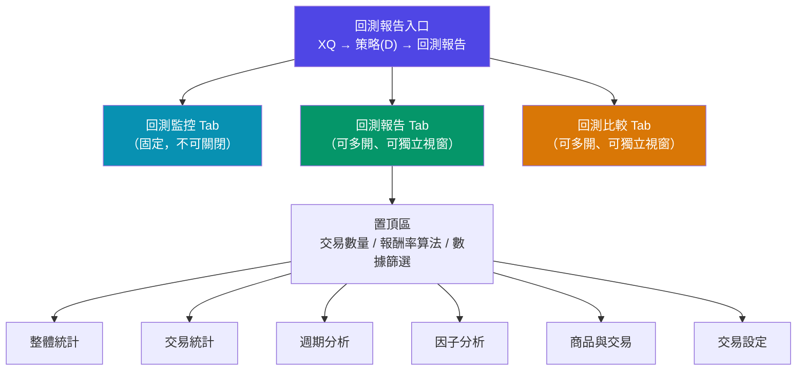
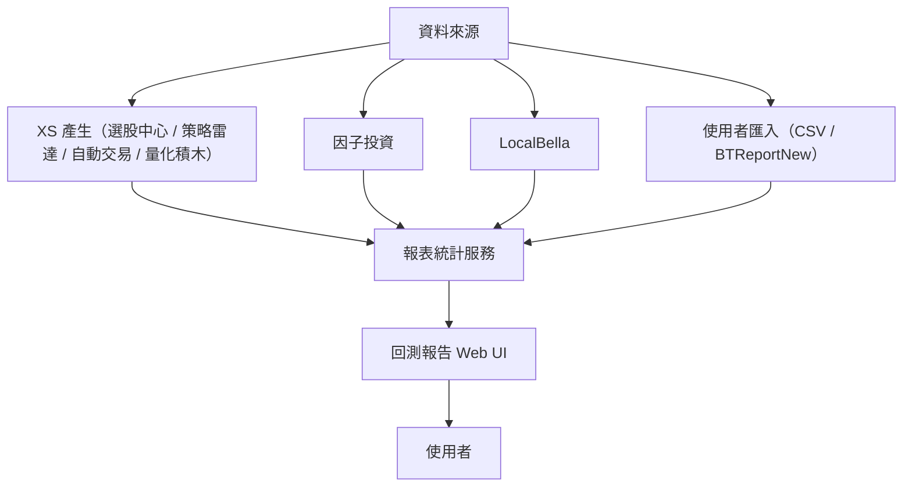

# 回測報告 — 專案快速導讀

> 本專案旨在統一 MoneyDJ XQ 平台（選股中心、策略雷達、自動交易）的**回測報告算法與 UI**，並強化分析功能。

---

## 目錄

- [專案目標](#專案目標)
- [適用範圍](#適用範圍)
- [文件結構](#文件結構)
- [如何開始](#如何開始)
- [PRD 快速索引](#prd-快速索引)
- [前端 Prototype](#前端-prototype)
- [聯絡窗口](#聯絡窗口)

---

## 專案目標

1. **統一回測計算算法**：確保各平台（選股中心、策略雷達、自動交易、量化積木、因子投資、LocalBella）使用相同的計算邏輯
2. **統一回測 UI**：選股中心、策略雷達、自動交易三平台共用回測報告介面
3. **支援多種交易數量模式**：腳本、等額、等量、等比
4. **支援三種報酬率算法**：時間加權報酬率（TWRR）、最大投入報酬率（MIR）、金額加權報酬率（MWRR）
5. **提供資本倍數指標（MOIC）**：作為整體統計的固定欄位（不適用等比模式）
6. **支援匯入交易紀錄**：從 CSV 或 BTReportNew 格式匯入
7. **強化分析功能**：週期分析、因子分析

---

## 適用範圍

| 產品 | 回測計算 | 回測 UI |
|------|---------|---------|
| 選股中心 | ✓ | ✓ |
| 策略雷達 | ✓ | ✓ |
| 自動交易 | ✓ | ✓ |
| 量化積木 | ✓ | — |
| 因子投資 | ✓ | — |
| LocalBella | ✓ | — |

---

## 文件結構

```
WorkSpace/
├── README.md               ← 本文件（快速導讀）
├── CLAUDE.md               ← AI 助理行為規範（Claude Code 專用）
├── docs/
│   ├── prd/                ← 各功能 PRD 文件
│   │   ├── 01-概述與適用範圍.md
│   │   ├── 02-流程架構.md
│   │   ├── 03-交易紀錄.md
│   │   ├── 04-回測設定.md
│   │   ├── 05-回測報告介面.md
│   │   ├── 06-匯出功能.md
│   │   └── 07-欄位計算.md
└── web/                    ← Prototype
```

---

## 如何開始

### 閱讀順序

1. 先看 `CLAUDE.md` — 了解專案核心架構與不可更動的原則
2. 然後依需求查閱 `docs/prd/` 下對應功能的 PRD 文件

### 啟動前端 Prototype

```bash
cd web && npm run dev
```

---

## PRD 快速索引

| 文件 | 內容摘要 |
|------|---------|
| [01-概述與適用範圍](./docs/prd/01-概述與適用範圍.md) | 專案目標、適用平台、利害關係人 |
| [02-流程架構](./docs/prd/02-流程架構.md) | 回測流程、逾期處理、重新回測、失敗 Retry、匯出、手動上傳 |
| [03-交易紀錄](./docs/prd/03-交易紀錄.md) | 資料來源、交易數量規則、統一格式、CSV 匯入規格 |
| [04-回測設定](./docs/prd/04-回測設定.md) | 系統參數（S→K→P→R）、執行回測對話框（三平台共用模組 + 差異模組 + 欄位字典）、報告 Tab 6 顯示參數 |
| [05-回測報告介面](./docs/prd/05-回測報告介面.md) | UI 架構、置頂區、各分析 Tab（整體統計、交易統計、週期分析、因子分析、商品與交易；交易設定 Tab 細節見 PRD 04 §4）|
| [06-匯出功能](./docs/prd/06-匯出功能.md) | CSV 匯出、XLSX 完整匯出、各分頁格式規格 |
| [07-欄位計算](./docs/prd/07-欄位計算.md) | 所有欄位的計算公式（含等比模式特殊規格）|

---

## 前端 Prototype

- **技術棧**：Vite + React 18 + React Router v6（JSX，非 TypeScript）
- **啟動指令**：`cd frontend && npm run dev`
- **對應原則**：一份 PRD 對應一個前端 Feature 模組

各 PRD 中的「📐 前端 Prototype 規劃（Vite）」章節記錄了元件名稱、功能說明與實作建議。

---

## 系統架構

### 整體架構



### 資料流架構



### 前端模組規劃

| 模組 | 主要元件 | 對應 PRD |
|------|---------|---------|
| 進入點 | `BacktestReportApp.jsx` | PRD 05 |
| 回測監控 | `BacktestMonitorList.jsx` | PRD 05 |
| 目錄管理 | `SidebarTree.jsx` | PRD 05 |
| 置頂區 | `StickyHeader.jsx` | PRD 05 |
| 整體統計 | `OverallStatsTab.jsx` | PRD 05 |
| 交易統計 | `TradeStatsTab.jsx` | PRD 05 |
| 週期分析 | `PeriodAnalysisTab.jsx` | PRD 05 |
| 因子分析 | `FactorAnalysisTab.jsx` | PRD 05 |
| 商品與交易 | `ProductTradeTab.jsx` | PRD 05 |
| 交易設定（Tab 6）| `TradeConfigTab.jsx` | PRD 04 |
| 匯出選單 | `ExportMenu.jsx` | PRD 06 |
| 匯入對話框 | `ImportDialog.jsx` | PRD 03 |
| 系統參數 | `SystemParamsPanel.jsx` | PRD 04 |
| 執行回測對話框 | `LaunchBacktestDialog.jsx` | PRD 04 |

### 版本規劃

| 版本 | 範圍 | 狀態 |
|------|------|------|
| v1.0 | 核心回測流程、基本 UI、整體統計、交易設定 | 規劃中 |
| v1.1 | 交易統計、週期分析 | 規劃中 |
| v1.2 | 因子分析、商品與交易進階功能 | 規劃中 |
| v2.0 | 回測比較功能 | 規劃中 |

> 詳細 Tab 功能說明請參考 [`docs/Sitemap.md`](./docs/Sitemap.md)

---

## 聯絡窗口

| 角色 | 姓名 |
|------|------|
| PM | 陳廣謙 |
| XQ | 涂文宜 |
| XS 後端 | 楊育瑋、蔣朝勛 |
| 回測計算 | 蕭景耀 |
| UI 建置 | 辛明芳、林詠涵 |
| UI 設計 | 呂佳薇 |
