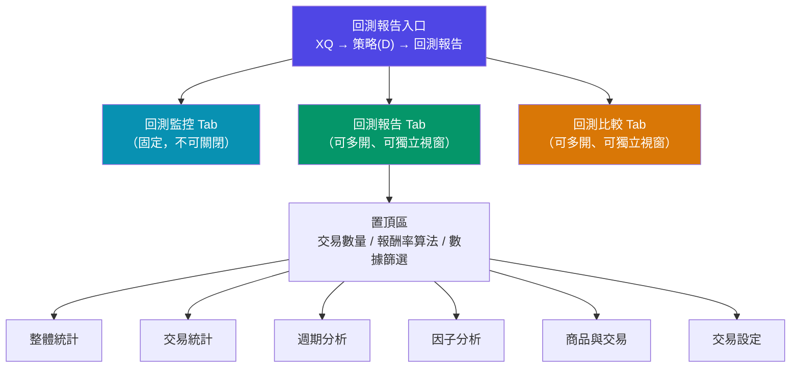
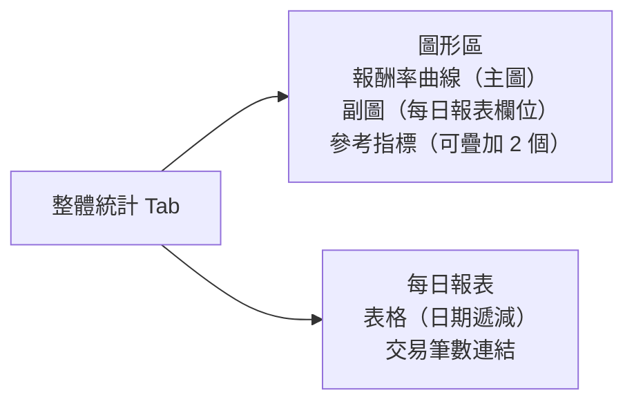
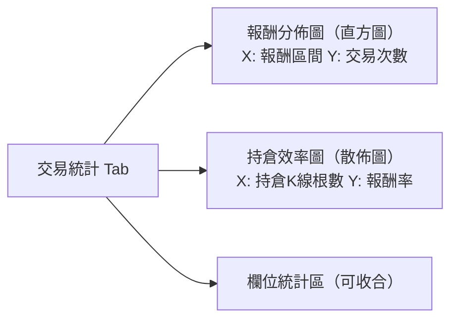
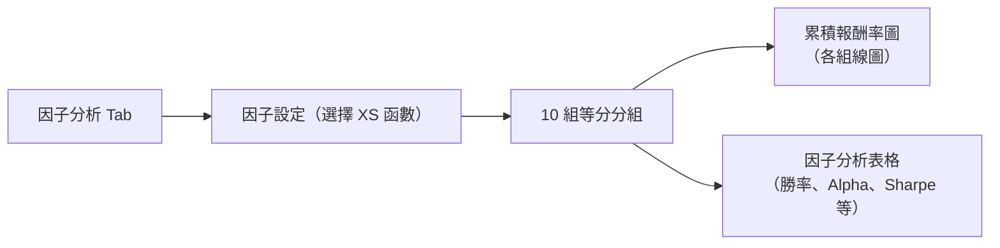
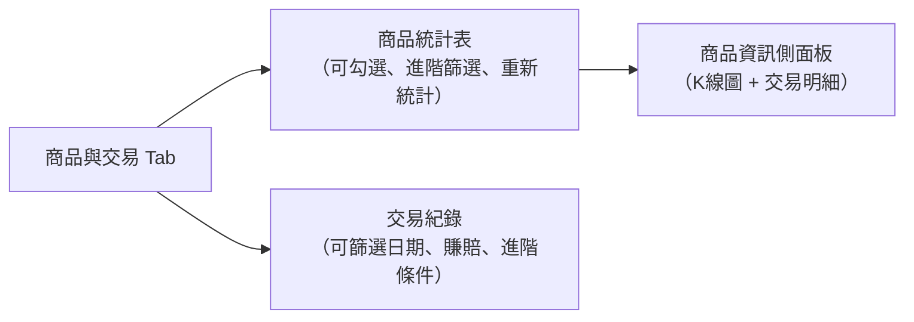
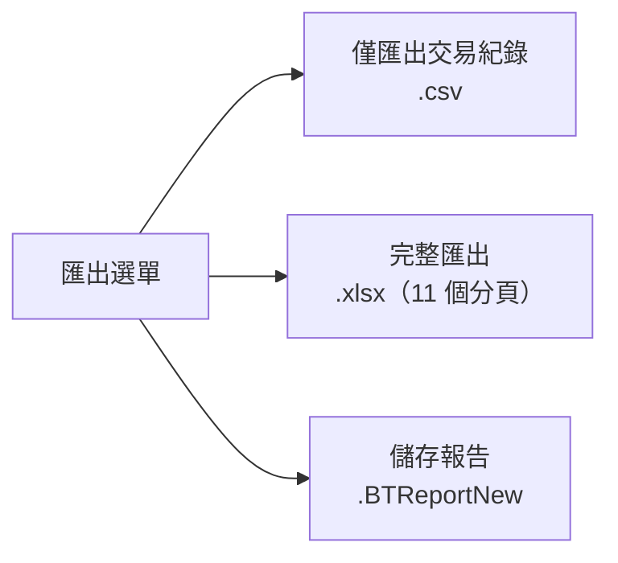
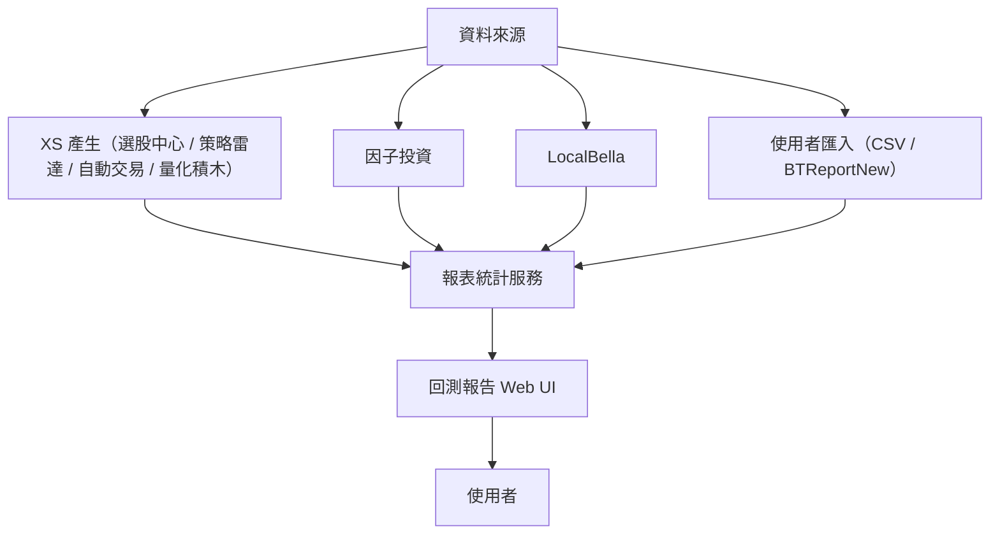

# Sitemap — 回測報告專案規劃

> 本文件描述「回測報告」專案的整體功能規劃與模組架構。
> 詳細 UI 規格請參考 `docs/prd/` 下的各功能 PRD 文件。

---

## 整體架構

---

## 功能模組一覽

### 1. 回測監控

| 功能 | 說明 |
|------|------|
| 多工監控 | 同時顯示多個回測任務的執行進度 |
| 狀態管理 | 執行中 / 暫停 / 成功 / 失敗 |
| 快速操作 | 暫停、繼續、刪除、重新回測 |
| 自動導航 | 回測成功後自動開啟報告 Tab，監控列 1 分鐘後移除 |

### 2. 回測報告

#### 2.1 置頂區（全局設定）

| 設定項目 | 選項 |
|---------|------|
| 交易數量 | 原始、等量、等額、等比 |
| 報酬率算法 | 最大投入報酬率、時間加權報酬率 |
| 數據篩選 | 全（自動交易：全 / 多 / 空）|
| 功能 | 備註（記事本）、匯出、重新回測 |

#### 2.2 整體統計 Tab

#### 2.3 交易統計 Tab

#### 2.4 週期分析 Tab

| 頻率 | 圖表說明 |
|------|---------|
| 日 | 1日～31日 / 星期一～五 / 每一日（長條圖）|
| 月 | 1月～12月 / 每一月 / 熱力圖（年 × 月）|
| 季 | Q1～Q4 / 每一季 / 熱力圖（年 × 季）|
| 年 | 每一年 / 熱力圖（年）|

#### 2.5 因子分析 Tab

#### 2.6 商品與交易 Tab

#### 2.7 交易設定 Tab

| 區域 | 內容 |
|------|------|
| A 設定資訊 | 回測資料範圍、執行時間、商品、交易設定詳情 |
| B 腳本資料 | 腳本名稱 Tab、修改日期、複製按鈕、XS 程式碼顯示 |

---

## 匯出模組

**XLSX 完整匯出分頁**：整體統計、設定、每日報表、商品統計表、交易分析、族群透視、週期分析（日/月/季/年）、單商品統計

---

## 資料流架構

---

## 前端模組規劃

| 模組 | 主要元件 | 對應 PRD |
|------|---------|---------|
| 進入點 | `BacktestReportApp.jsx` | PRD 05 |
| 回測監控 | `BacktestMonitorList.jsx` | PRD 05 |
| 目錄管理 | `SidebarTree.jsx` | PRD 05 |
| 置頂區 | `StickyHeader.jsx` | PRD 05 |
| 整體統計 | `OverallStatsTab.jsx` + `ReturnChart.jsx` | PRD 05 |
| 交易統計 | `TradeStatsTab.jsx` | PRD 05 |
| 週期分析 | `PeriodAnalysisTab.jsx` + `HeatmapChart.jsx` | PRD 05 |
| 因子分析 | `FactorAnalysisTab.jsx` | PRD 05 |
| 商品與交易 | `ProductTradeTab.jsx` + `KLineChart.jsx` | PRD 05 |
| 交易設定 | `TradeConfigTab.jsx` + `ScriptViewer.jsx` | PRD 05 |
| 匯出選單 | `ExportMenu.jsx` | PRD 06 |
| 匯入對話框 | `ImportDialog.jsx` + `CsvImportDialog.jsx` | PRD 03 |
| 系統設定 | `SystemParamsPanel.jsx` + `TradeSettingsPanel.jsx` | PRD 04 |

---

## 版本規劃

| 版本 | 範圍 | 狀態 |
|------|------|------|
| v1.0 | 核心回測流程、基本 UI、整體統計、交易設定 | 規劃中 |
| v1.1 | 交易統計、週期分析 | 規劃中 |
| v1.2 | 因子分析、商品與交易進階功能 | 規劃中 |
| v2.0 | 回測比較功能 | 規劃中 |
