# PRD — 回測報告：流程架構

> **版本**：v2.0 | **日期**：2026-04-22

---

## 1. 回測流程（一般）

### 說明

- 商品清單包含成功與失敗商品
- **本流程角色職責**：
  - **XQ 主程式**：發起回測、備份紀錄至 Local Storage
  - **XS Hub**：執行腳本、產出回測 ID 與交易紀錄
  - **Server**：統計報表、暫存至 Server DB
  - **Web UI**：揭示報表結果
- **XQ ↔ Web UI 互動**：XQ 開啟 Web UI 時透過 **URL 參數**帶入回測 ID；Web UI 再透過 **Sinker** 回傳回測 ID 給 XQ，並可向 XQ 請求參數、腳本與商品清單。
- **資料備援**：XQ 讀寫 Local Storage 保留回測備份；Server 讀寫 Server DB 暫存報表資料。

### 控制流程（CFD）

起點 🟢：XQ → XS Hub「執行回測」。

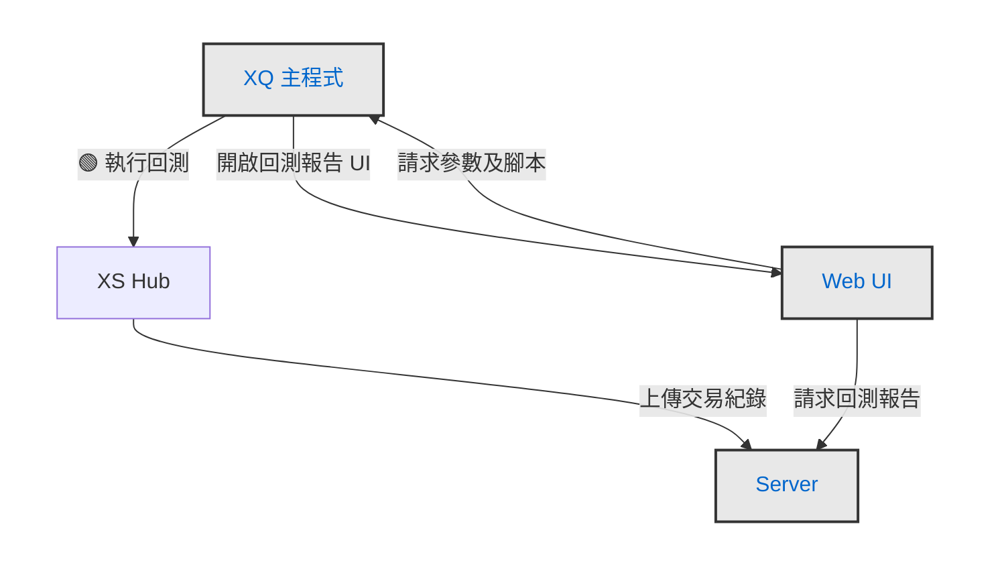

### 資料流程（DFD）

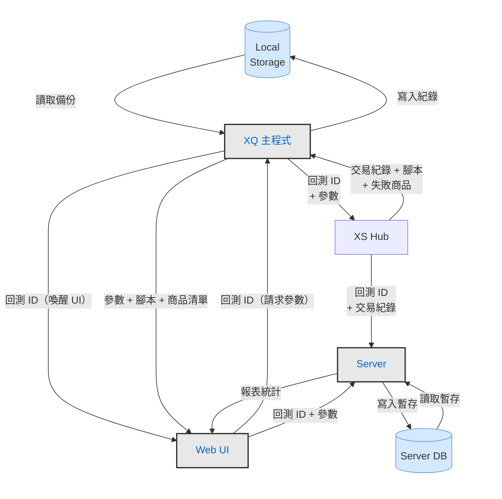

---

## 2. Server 紀錄逾期流程

### 說明

- Server 暫存的回測資料逾期未被取用會被清除，此時 Web UI 向 Server 請求資料會得到 **Error Not Found**
- **統一動線**：Web UI 關閉，錯誤訊息在 XQ 顯示
- **情境 A（XQ 有回測 ID）**：Web UI 通知 XQ「請求救援」，XQ 讀 Local Storage 備份後把交易紀錄送回 Server，Server 重建暫存資料後繼續處理（下方 CFD/DFD 描述此情境）
- **情境 B（XQ 無回測 ID）**：無備份可救，重新進入 §1 一般回測流程

### 控制流程（CFD）

起點 🟢：Server → Web UI「Error Not Found」。

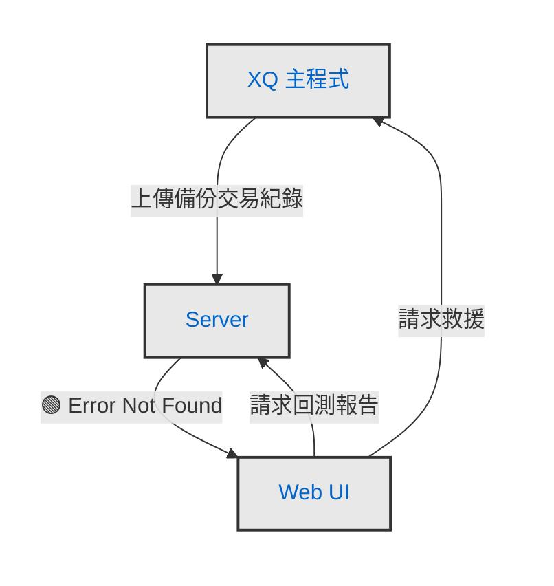

### 資料流程（DFD）

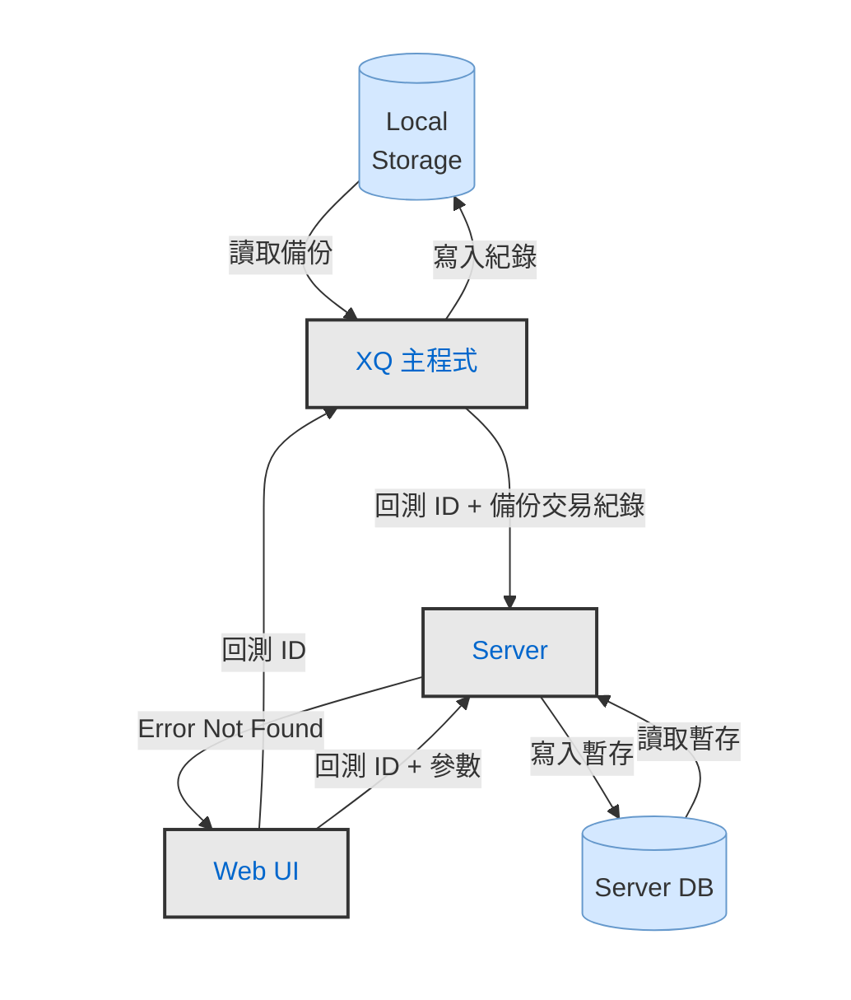

---

## 3. 重新回測流程

### 說明

- Web UI 將目前的回測 ID 傳給 XQ，XQ 帶出對應的回測參數後**接續 §1 回測流程**完成重新回測
- **舊 UI 不關閉**：新的回測報告 Tab 另開，原有分頁保留供對照

### 控制流程（CFD）

起點 🟢：Web UI → XQ「重新回測」。觸發後接續 §1 回測流程。

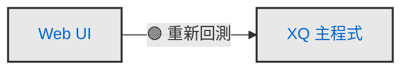

### 資料流程（DFD）

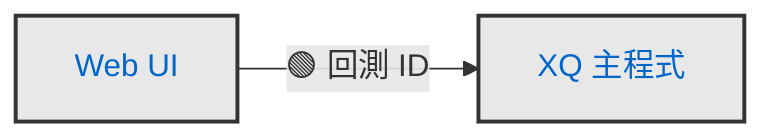

---

## 4. 失敗商品 Retry 流程

### 說明

- 只對 **timeout 的商品**重新送出，不支援從失敗清單中選取特定商品
- Web UI 只送回測 ID 給 XQ（不帶商品清單）
- Web UI **暫時關閉**，失敗商品回測完成並 merge 後，再重新喚醒 Web UI
- **Merge 位置**：新舊交易紀錄由 **XS Hub** 合併後上傳 Server，非 Server 端 merge

### 控制流程（CFD）

起點 🟢：Web UI → XQ「失敗商品 Retry」。

### 資料流程（DFD）

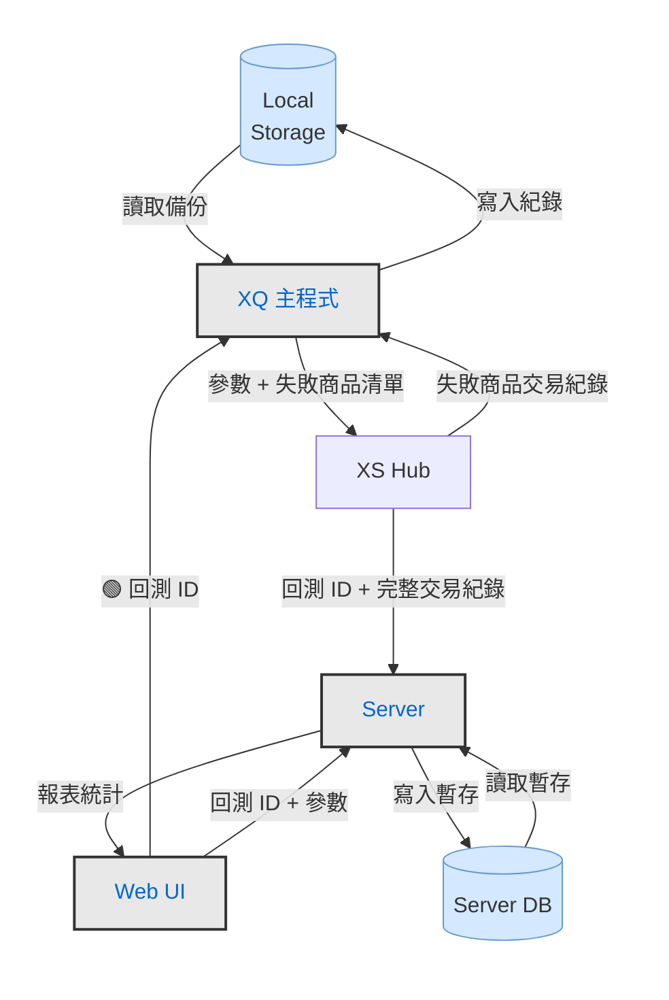

---

## 5. 匯出報告流程

### 說明

- Web UI 發起匯出後，由 **XQ 主程式**向 Server 請求回測報告並落地為檔案
- 匯出格式與差異：

| 格式 | 說明 |
|------|------|
| `.csv` | 純交易紀錄 |
| `.xlsx` | 全部回測報告內容（完整匯出）|
| `.BTReportNew` | 新版格式，依 Server 格式儲存 |
| 舊 `.btreport` | 支援舊版 UI 開啟；重新回測需帶新版參數，重走一次完整流程 |

### 控制流程（CFD）

起點 🟢：Web UI → XQ「匯出回測報告」。

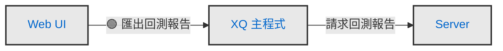

### 資料流程（DFD）

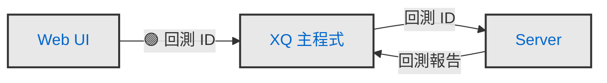

---

## 6. 手動上傳流程

### 說明

- 觸發起點為 **XQ 主動上傳交易紀錄**給 Server（與 §1「XQ→XS Hub」不同，無需跑腳本）
- **入口位置**：XScript 編輯器選單（「開啟回測報告...」對應 BTReportNew；「上傳交易紀錄...」對應 CSV）
- XQ 另行開啟 Web UI 揭示報表結果，Web UI 再向 XQ 請求參數、腳本、商品清單以完整呈現報告
- **匯入類型與本地處理邏輯**（於 XQ 端執行，不涉及跨系統資料流）：
  - 匯入 `.BTReportNew`：直接開啟回測報告，無需重新計算
  - 匯入 `.csv` 交易紀錄：開啟「上傳回測設定對話框」設定計算參數後執行報表統計，欄位格式錯誤則顯示訊息請使用者修正（詳見 PRD 03 §4）

### 控制流程（CFD）

起點 🟢：XQ → Server「手動上傳交易紀錄」。

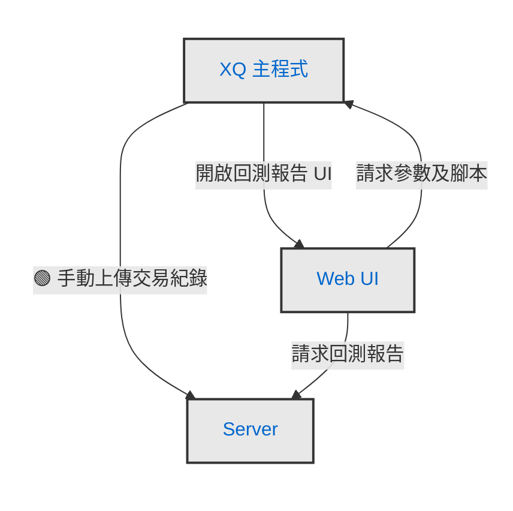

### 資料流程（DFD）

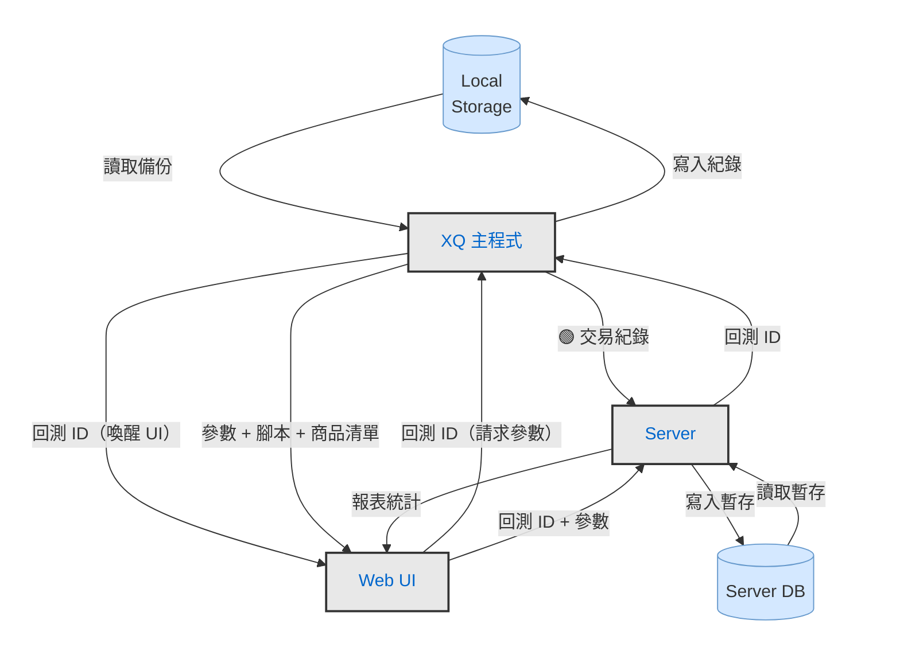

---

## 7. 小範圍篩選回測流程

### 說明

- 使用者於 Web UI 的商品統計表勾選特定商品後，點選「重新統計」觸發流程
- **三角流（XS Hub 不參與）**：Web UI 不自行統計，而是由 **XQ 主程式**把篩選後的交易紀錄上傳給 **Server**，由 Server 產生新的回測 ID 並重新統計
- 新的回測報告於 Web UI **另開一個 Tab** 呈現，原有報告保留供對照

### 控制流程（CFD）

起點 🟢：Web UI → XQ「以篩選交易紀錄回測」。

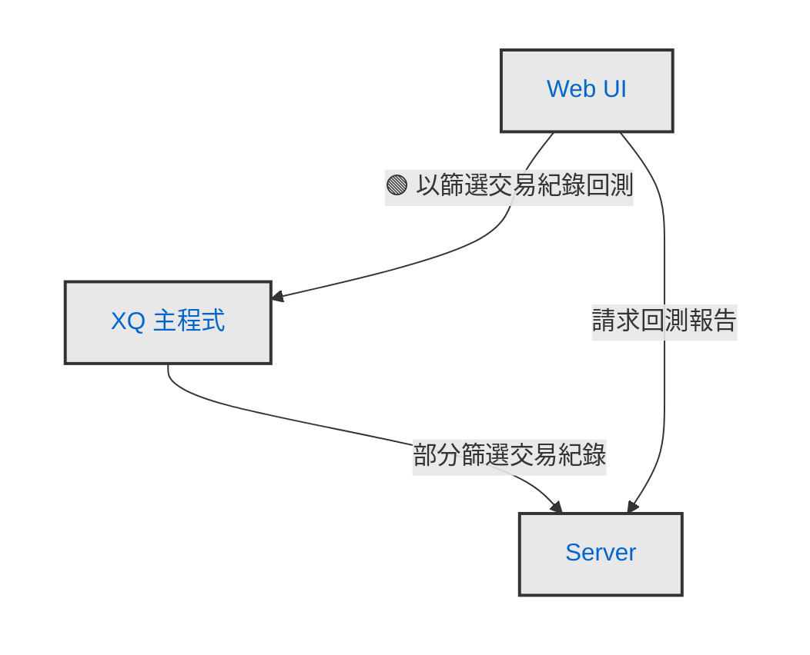

### 資料流程（DFD）

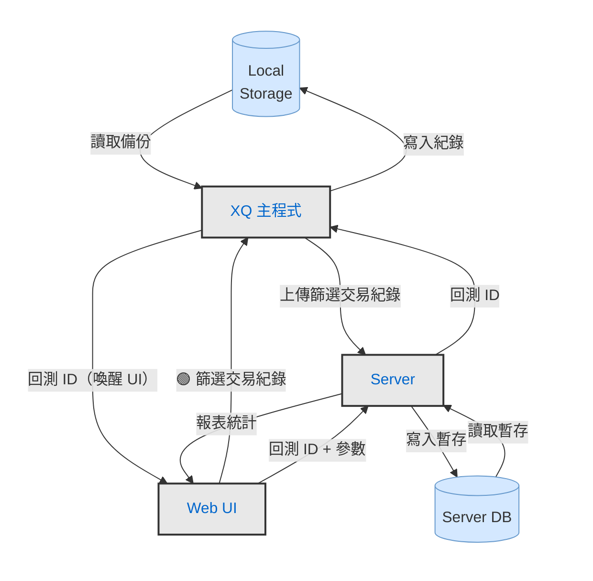

