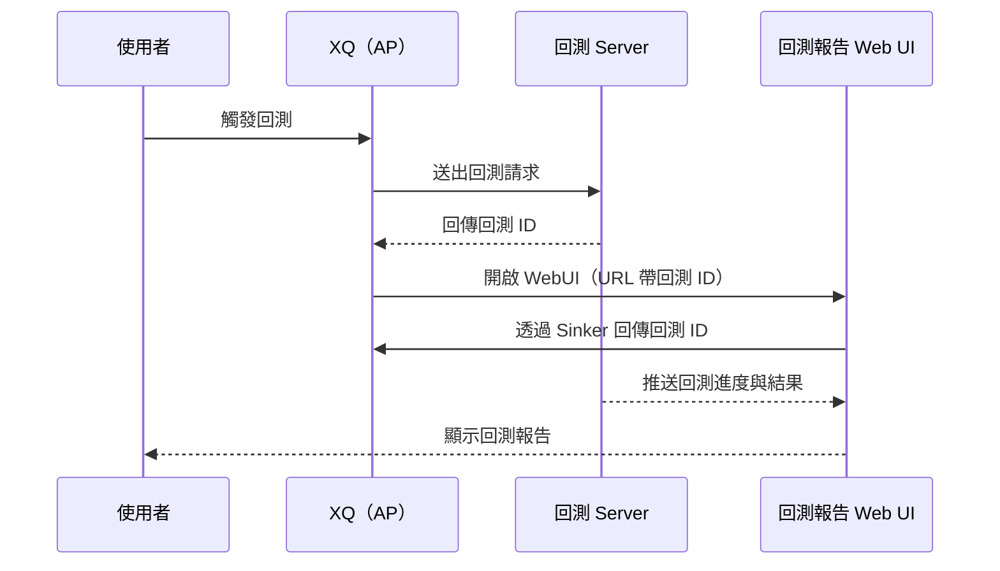
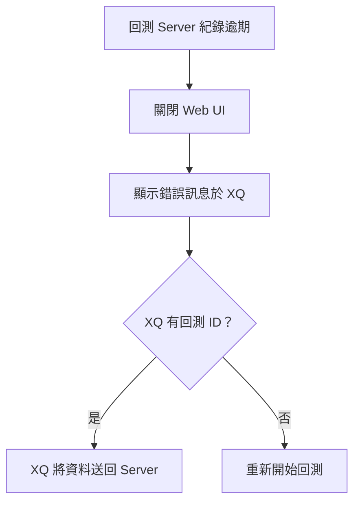
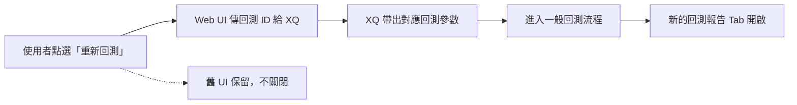
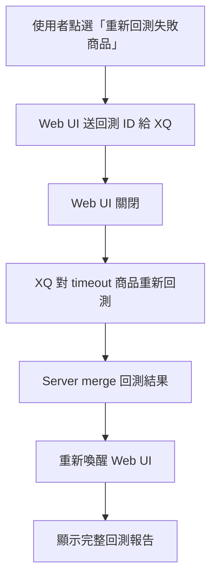
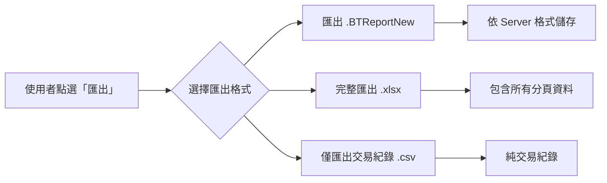
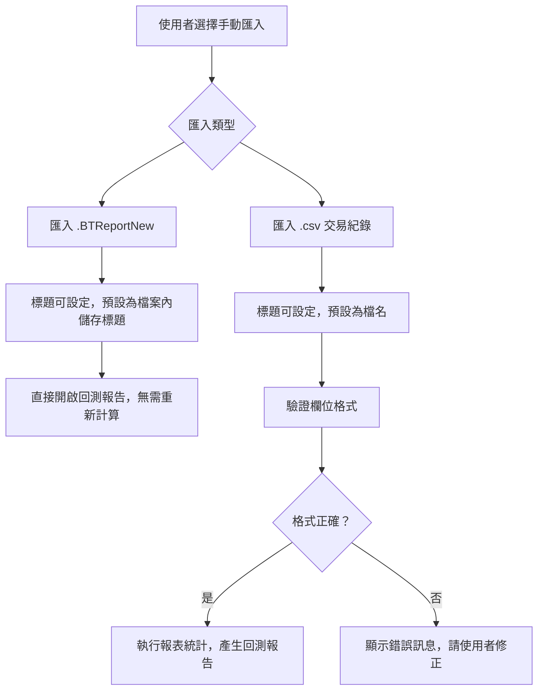
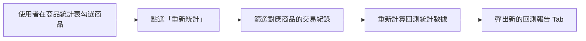

# PRD 02 — 回測報告：流程架構

> **版本**：v1.0 | **日期**：2026-03-11 | **狀態**：Draft
> **原始 Spec**：`docs/reference/pdf-convert/回測報告-流程架構-Spec.md`

---

## Spec 格式問題標註

> ⚠️ **標題層級不一致**：原始 Spec 中，「回測流程」使用 `####`、「Server紀錄逾期流程」使用 `##`、「重新回測流程」使用 `#`，建議統一為同一層級。

---

## 1. 回測流程（一般）

### 說明

- 商品清單包含成功與失敗商品
- AP（XQ 應用程式）與 Web UI 互動流程：
  1. AP 開啟 Web UI 時，透過 **URL 參數**帶入回測 ID
  2. Web UI 接收後，透過 **Sinker** 將回測 ID 回傳給 AP

### 流程圖

> 📐 **前端 Prototype 規劃（Vite）**
> - 元件：`BacktestProgressPage.jsx`
> - 功能：顯示回測進度條、監控狀態（執行中 ▶️ / 暫停 ⏸️ / 成功 ✅ / 失敗 ❌）
> - 實作方式：從 URL Query String 取得 `backtestId`，polling 後端狀態 API
> - 元件路徑：`frontend/src/features/flow-architecture/flows/BacktestProgressPage.jsx`
> - 入口：`frontend/src/features/flow-architecture/FlowArchitectureDemo.jsx`（Tab：① 一般回測）

---

## 2. Server 紀錄逾期流程

### 說明

- 統一行為：關閉 Web UI，錯誤訊息顯示在 XQ
- **情境 A（XQ 有 ID）**：XQ 把資料丟給 Server，由 Server 繼續處理
- **情境 B（XQ 沒有 ID）**：重新開始回測

### 流程圖

> 📐 **前端 Prototype 規劃（Vite）**
> - 元件：`BacktestErrorBanner.jsx`
> - 功能：在偵測到逾期狀態時，顯示錯誤提示並提供「重新回測」按鈕
> - 實作方式：攔截 API 的 session expired 錯誤碼，呼叫 XQ Sinker 通知關閉
> - 元件路徑：`frontend/src/features/flow-architecture/flows/BacktestErrorBanner.jsx`
> - 入口：`frontend/src/features/flow-architecture/FlowArchitectureDemo.jsx`（Tab：② Server 逾期）

---

## 3. 重新回測流程

### 說明

- Web UI 將目前的回測 ID 傳給 XQ，XQ 帶出對應的回測參數
- 接著走一般回測流程
- **舊 UI 不關閉**（新的回測報告 Tab 另開）

### 流程圖

> 📐 **前端 Prototype 規劃（Vite）**
> - 元件：`RerunBacktestButton.jsx`
> - 功能：點擊後呼叫 Sinker 傳 ID 給 XQ，並在新 Tab 載入新回測報告
> - 實作方式：`window.open()` 帶新回測 ID，保留現有頁面
> - 元件路徑：`frontend/src/features/flow-architecture/flows/RerunBacktestButton.jsx`
> - 入口：`frontend/src/features/flow-architecture/FlowArchitectureDemo.jsx`（Tab：③ 重新回測）

---

## 4. 失敗商品 Retry 流程

### 說明

- 只對 **timeout 的商品**重新送出，不支援從失敗清單中選取特定商品
- Web UI 只送回測 ID 給 XQ（不帶商品清單）
- Web UI **暫時關閉**，失敗商品回測完成並 merge 後，再重新喚醒 Web UI

### 流程圖

> 📐 **前端 Prototype 規劃（Vite）**
> - 元件：`FailedProductsRetryPanel.jsx`
> - 功能：顯示失敗商品清單（商品名稱 / 狀態 / 說明）並提供 Retry 按鈕
> - 注意：Retry 按鈕只傳 ID，不允許勾選特定商品
> - 元件路徑：`frontend/src/features/flow-architecture/flows/FailedProductsRetryPanel.jsx`
> - 入口：`frontend/src/features/flow-architecture/FlowArchitectureDemo.jsx`（Tab：④ 失敗 Retry）

---

## 5. 匯出報告流程

### 說明

| 格式 | 說明 |
|------|------|
| `.csv` | 純交易紀錄 |
| `.xlsx` | 全部回測報告內容（完整匯出）|
| `.BTReportNew` | 新版格式，依 Server 格式儲存 |
| 舊 `.btreport` | 支援舊版 UI 開啟；重新回測需帶新版參數，重走一次完整流程 |

### 流程圖

> 📐 **前端 Prototype 規劃（Vite）**
> - 元件：`ExportMenu.jsx`
> - 功能：下拉式選單，提供三種匯出格式
> - 實作方式：呼叫後端匯出 API，取得 Blob 後觸發瀏覽器下載
> - 元件路徑：`frontend/src/features/flow-architecture/flows/ExportMenu.jsx`
> - 入口：`frontend/src/features/flow-architecture/FlowArchitectureDemo.jsx`（Tab：⑤ 匯出報告）

---

## 6. 手動上傳流程

### 說明

> ⚠️ **Spec 未完成事項**（需追蹤）：
> - XQ 入口位置尚未確認
> - 是否能在上傳時設定參數，尚未決議

### 流程圖

> 📐 **前端 Prototype 規劃（Vite）**
> - 元件：`ImportDialog.jsx`
> - 功能：提供拖放或點擊上傳 `.BTReportNew` / `.csv` 的對話框
> - 包含格式驗證提示與錯誤訊息顯示
> - 元件路徑：`frontend/src/features/flow-architecture/flows/ImportDialog.jsx`
> - 入口：`frontend/src/features/flow-architecture/FlowArchitectureDemo.jsx`（Tab：⑥ 手動上傳）

---

## 7. 小範圍篩選回測流程

### 說明

允許使用者從商品統計表中勾選特定商品，重新統計成新的回測報告。

### 流程圖

> 📐 **前端 Prototype 規劃（Vite）**
> - 元件：`ProductFilterRerunButton.jsx`
> - 功能：在商品統計表多選後，觸發「重新統計」並開啟新 Tab
> - 僅在 checkbox 有選取時顯示此按鈕
> - 元件路徑：`frontend/src/features/flow-architecture/flows/ProductFilterRerunButton.jsx`
> - 入口：`frontend/src/features/flow-architecture/FlowArchitectureDemo.jsx`（Tab：⑦ 小範圍篩選）
