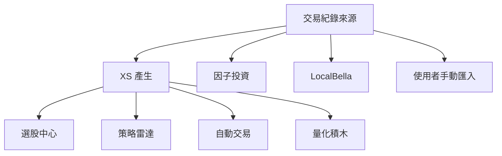

# PRD 03 — 回測報告：交易紀錄

> **版本**：v1.0 | **日期**：2026-03-11 | **狀態**：Draft
> **原始 Spec**：`docs/reference/pdf-convert/回測報告-交易紀錄-Spec.md`

---

## 1. 交易紀錄來源

---

## 2. 交易數量規則

| 來源 | 交易數量規則 |
|------|-------------|
| XS 產生（自動交易自訂除外）| 固定為 `-1`，由報表統計服務依系統設定調整 |
| 量化積木 | 固定為「**等量**」|
| 因子投資 | 固定為「**等比**」|
| LocalBella | 固定為「**等量**」|
| 使用者匯入 | 由使用者**自行設定** |

> ℹ️ **User Story**
> 作為報表統計服務，我需要接收統一格式的交易數量（預設 -1），並根據平台設定自動轉換為等額 / 等量 / 等比等模式，確保各平台的計算邏輯一致。

---

## 3. 統一格式規範

各回測平台依回測設定參數，產生完整的進出場點位，並回傳統一格式的交易紀錄。

### 3.1 交易參數

| 參數 | 說明 |
|------|------|
| 回測起始日期 | — |
| 回測結束日期 | — |
| 交易稅 % | 百分比 |
| 固定交易稅 | 固定金額 |
| 手續費 % | 百分比 |
| 固定交易費 | 固定金額 |
| 初始資金 | — |
| 槓桿 / 融資倍數 | — |

### 3.2 交易明細欄位

| 欄位 | 格式 |
|------|------|
| 商品名稱 | — |
| 進場日期 | `yyyy:MM:dd` |
| 進場時間 | `HH:MM:ss.fff` |
| 進場價格 | double |
| 出場日期 | `yyyy:MM:dd` |
| 出場時間 | `HH:MM:ss.fff` |
| 出場價格 | double |
| 交易數量 | — |
| Lots | 系統根據商品自動帶入 |

> ⚠️ **Spec 格式問題**：進場日期格式標記為 `yyyy:MM:dd`，但一般慣例為 `yyyy/MM/dd` 或 `yyyy-MM-dd`，冒號分隔符號需確認是否為筆誤。

---

## 4. 匯入規格

### 4.1 舊版 BTReport

- 現有 BTReport 仍可從**舊入口**匯入
- 只支援**舊版 UI** 開啟
- 點選「重新回測」後，需以**新版參數設定**重新產出交易紀錄

### 4.2 新版 BTReport（.BTReportNew）

- 支援 Web UI 內所有功能
- **不需要重新執行**報表統計即可開啟
- 匯入時可設定回測報告標題（預設使用檔案內儲存的標題）

> ℹ️ **User Story**
> 作為使用者，我希望匯入新版 BTReportNew 後可以直接使用所有報告功能，
> 不需要等待重新計算，以便快速查看歷史回測結果。

### 4.3 匯入 CSV

- 分隔符號：**逗號（,）**
- 預設標題：**檔名**（可於匯入時自訂）

#### 必要欄位

| 欄位名稱 | 格式 | 備註 |
|---------|------|------|
| 商品代碼 | XQ 商品代碼 | — |
| 進場時間 | `yyyy/mm/dd` 或 `yyyy/mm/dd HH:MM:ss` | — |
| 進場價格 | double | — |
| 出場時間 | `yyyy/mm/dd` 或 `yyyy/mm/dd HH:MM:ss` | — |
| 出場價格 | double | — |
| 交易數量 | integer | — |

#### 錯誤訊息規格

| 錯誤類型 | 顯示訊息 |
|---------|---------|
| 必要欄位缺失 | 「請確認交易紀錄是否包含以下欄位：商品代碼、進場時間、進場價格、出場時間、出場價格、交易數量。」 |
| 欄位重複 | 「請確認交易紀錄是否有重複的欄位。」 |
| 格式錯誤 | 「請確認 [欄位名稱] 的格式。」 |

> 📐 **前端 Prototype 規劃（Vite）**
> - 元件：`CsvImportDialog.jsx`
> - 功能：
>   1. 檔案上傳（拖放 / 點擊）
>   2. 標題設定輸入框（預設帶入檔名）
>   3. 格式驗證（前端先做基本欄位名稱檢查）
>   4. 錯誤訊息區塊（列出所有格式問題）
> - 實作方式：使用 `FileReader` 讀取 CSV，以 `Papa Parse` 解析並驗證欄位

> ℹ️ **User Story**
> 作為使用者，當我上傳格式錯誤的 CSV 時，
> 我希望能看到明確的錯誤說明，告訴我哪個欄位出了什麼問題，
> 以便快速修正並重新匯入。
