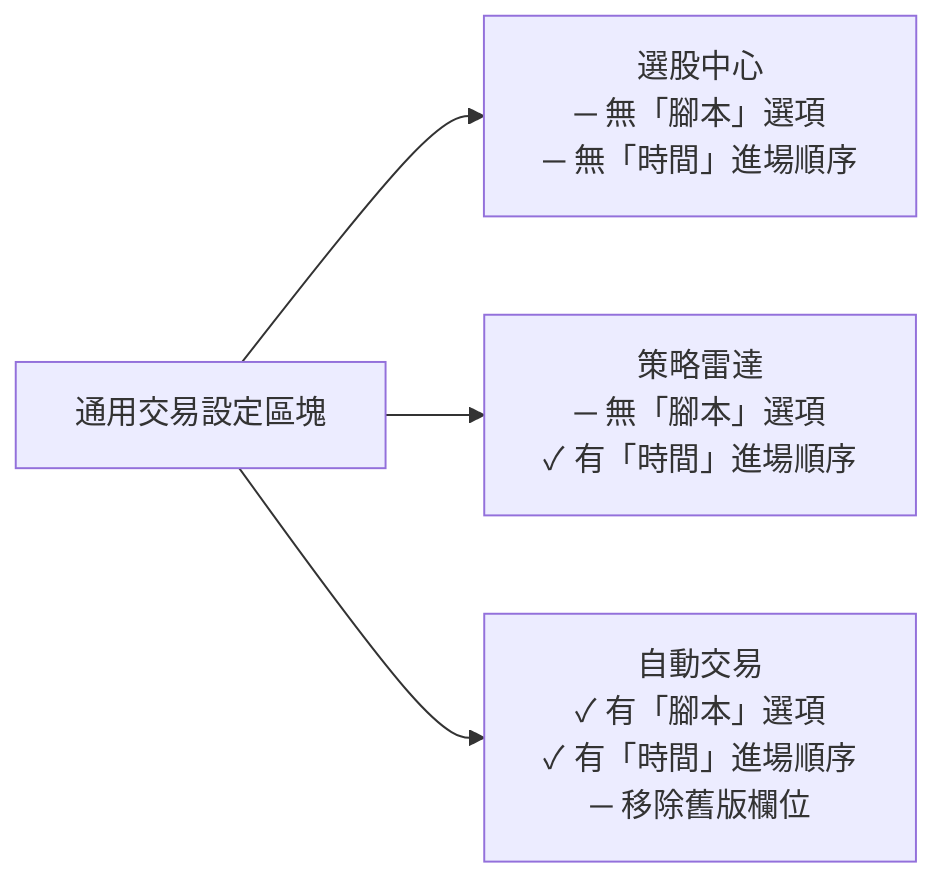

# PRD 04 — 回測報告：回測設定

> **版本**：v1.1 | **日期**：2026-04-16 | **狀態**：Draft
> **原始 Spec**：`docs/reference/pdf-convert/回測報告-回測設定-Spec.md`

---

## Spec 格式問題標註

> ⚠️ **OCR 亂碼**：Spec 第 61 行出現「W-700/00/35 | E187」，疑似為 OCR 掃描的殘影，原始內容應為某交易設定參數值，需確認原始文件。

> ⚠️ **表格結構**：Spec 第 2 節的通用交易設定表格因 OCR 導致格式混亂，本 PRD 已依文字描述重新整理。

---

## 1. 系統參數設定

**路徑**：系統 (S) → 設定 (K) → 系統參數 (P) → 回測報告 (R)

### 1.1 介面整合原則

| 項目 | 說明 |
|------|------|
| 介面統一 | 移除舊有「自動交易」專屬字眼，改為三平台通用介面 |
| 適用平台 | 選股中心、策略雷達、自動交易 |
| 設定獨立 | 三個平台的設定值**獨立儲存**，互不影響 |
| 移除項目 | 不再提供「預設欄位顯示單位」設定 |

### 1.2 預設參數邏輯

| 設定項目 | 選項內容 | 邏輯與限制 | Tooltip 說明 |
|---------|---------|-----------|-------------|
| 預設交易數量 | 腳本（僅自動交易）、等額 [萬元]、等量 [股]、等比 | 「腳本」選項僅在「自動交易」分頁顯示；「等額」「等量」可設定初始值 | 交易數量計算方式，影響回測報告數據呈現結果 |
| 預設報酬率算法 | 最大投入報酬、時間加權報酬 | 若交易數量選「等比」，系統強制鎖定為「時間加權報酬率」，不可切換 | 報酬率有最大投入報酬率與時間加權報酬率兩種方式 |
| 預設參考指標 | 買進持有報酬率、大盤指數報酬率、自選指標、不疊加 | 線圖最多可疊加**兩個**參考指標 | 線圖能疊加兩個參考指標，在此預設疊加的參考指標 |

---

## 2. 通用交易設定（各平台共用區塊）

**適用範圍**：選股中心、策略雷達、自動交易（三平台邏輯一致，部分選項依平台差異而不同，詳見第 3 節）

### 2.1 資金管理

| 設定項目 | 預設值 | 說明 | 備註 |
|---------|--------|------|------|
| 初始資金 | 1,000 萬元 | 限正整數，輸入框 | 三平台共用 |
| 最大同時交易筆數 | 10 筆 | Checkbox 預設**不勾選**；啟用後，資金用完時新訊號將被忽略 | 三平台共用 |
| 進場順序 | 自訂 | 決定同日訊號的交易優先權 | 部分選項依平台而異（詳見 3.2）|

**Tooltip**（最大同時交易筆數）：
> 啟用最大同時交易筆數時，若資金已用完，新的訊號就會被忽略，不會再投入資金。
> 範例：設為 1 筆則全數投入；設為 10 筆則每筆投入 10% 資金。

### 2.2 交易數量

此區塊根據使用者選擇的類型，**動態切換**輸入介面。

| 選擇類型 | UI 顯示 | 預設值 | 單位 | 支援平台 |
|---------|---------|--------|------|---------|
| 等額 | 輸入框「萬元」| 100 | 萬元 | 全平台 |
| 等量 | 輸入框「股」| 1,000 | 股 | 全平台 |
| 等比 | 不顯示輸入框 | — | — | 全平台 |
| 腳本 | 不顯示輸入框 | — | — | **僅自動交易** |

> ℹ️ **User Story**
> 作為使用者，當我選擇「等比」交易數量時，
> 系統應自動隱藏數值輸入框，並強制將報酬率算法鎖定為「時間加權報酬率」，
> 以避免我在不支援的算法組合下產生錯誤的回測結果。

### 2.3 交易成本

| 商品類型 | 費用項目 | 預設數值 | 單位 |
|---------|---------|---------|------|
| 期貨 | 手續費 | 100 | 元 |
| 期貨 | 交易稅 | 0.03 | % |
| 股票 | 手續費 | 0.1425 | % |
| 股票 | 交易稅 | 0.3 | % |

### 2.4 槓桿設定

| 設定項目 | 預設值 | 說明 |
|---------|--------|------|
| 啟用開關 | Checkbox（預設**勾選**）| — |
| 期貨保證金成數 | 13.5% | — |
| 股票融資成數 | 60% | UI 保留欄位，**暫不使用邏輯** |
| 股票融券保證金成數 | 90% | UI 保留欄位，**暫不使用邏輯** |

---

## 3. 三平台差異化規格

### 3.1 設定項目共用 vs 獨立對照表

#### 系統參數設定（S→K→P→R）

| 設定項目 | 選股中心 | 策略雷達 | 自動交易 |
|---------|---------|---------|---------|
| 預設交易數量：等額 | ✓ | ✓ | ✓ |
| 預設交易數量：等量 | ✓ | ✓ | ✓ |
| 預設交易數量：等比 | ✓ | ✓ | ✓ |
| 預設交易數量：腳本 | — | — | ✓ |
| 預設報酬率算法 | ✓ | ✓ | ✓ |
| 預設參考指標 | ✓ | ✓ | ✓ |
| 設定值獨立儲存 | ✓（獨立）| ✓（獨立）| ✓（獨立）|

#### 通用交易設定（回測時套用）

| 設定項目 | 選股中心 | 策略雷達 | 自動交易 | 備註 |
|---------|---------|---------|---------|------|
| 初始資金 | ✓ | ✓ | ✓ | — |
| 最大同時交易筆數 | ✓ | ✓ | ✓ | — |
| 進場順序：時間 | — | ✓ | ✓ | 需要時間戳資料，選股中心不支援 |
| 進場順序：股號 | ✓ | ✓ | ✓ | — |
| 進場順序：成交量 | ✓ | ✓ | ✓ | — |
| 進場順序：市值 | ✓ | ✓ | ✓ | — |
| 進場順序：股本 | ✓ | ✓ | ✓ | — |
| 進場順序：自訂排序 | ✓ | ✓ | ✓ | 支援排行函數 / Rank / OutputField |
| 交易數量：等額 | ✓ | ✓ | ✓ | — |
| 交易數量：等量 | ✓ | ✓ | ✓ | — |
| 交易數量：等比 | ✓ | ✓ | ✓ | — |
| 交易數量：腳本 | — | — | ✓ | 依腳本內設定，無數值輸入框 |
| 交易成本：期貨手續費 | ✓ | ✓ | ✓ | 預設 100 元 |
| 交易成本：期貨交易稅 | ✓ | ✓ | ✓ | 預設 0.03% |
| 交易成本：股票手續費 | ✓ | ✓ | ✓ | 預設 0.1425% |
| 交易成本：股票交易稅 | ✓ | ✓ | ✓ | 預設 0.3% |
| 槓桿：啟用開關 | ✓ | ✓ | ✓ | 預設勾選 |
| 槓桿：期貨保證金成數 | ✓ | ✓ | ✓ | 預設 13.5% |
| 槓桿：股票融資成數 | ✓ | ✓ | ✓ | 保留 UI，暫不使用邏輯 |
| 槓桿：股票融券保證金成數 | ✓ | ✓ | ✓ | 保留 UI，暫不使用邏輯 |

### 3.2 進場順序「時間」的平台限制說明

選股中心不支援「時間」進場順序，原因：選股中心的訊號產生機制沒有精確到毫秒的時間戳，無法依時間排序同日訊號。策略雷達與自動交易皆具備此資料，可支援。

### 3.3 自動交易獨有的舊版移除項目

| 移除項目 | 說明 |
|---------|------|
| 舊版「初始資金」設定欄位 | 已整合進通用交易設定的資金管理區塊 |
| 舊版「單邊交易費用」設定欄位 | 已整合進通用交易設定的交易成本區塊 |

### 3.4 三平台架構示意



---

## 4. User Story 總覽

```
作為使用者，
我希望系統能記憶我在各個平台（選股中心 / 策略雷達 / 自動交易）的回測參數設定，
並在每次執行回測時自動帶入，以減少重複設定的時間。
```

```
作為自動交易的使用者，
我希望能選擇「腳本」交易數量模式，讓交易數量完全由腳本內的邏輯決定，
以維持策略的完整性。
```

```
作為選股中心或策略雷達的使用者，
我不需要看到「腳本」這個選項，
以避免介面混亂。
```

---

## 5. 前端 Prototype 規劃

> 📌 **待補充**：此章節預留給 UI 格式設計，稍後由使用者提供樣式規格後填入。

**預計涵蓋內容**：
- `SystemParamsPanel` 元件：三平台 Tab 切換的系統參數設定畫面
- `TradeSettingsPanel` 元件：通用交易設定（資金管理 / 交易數量 / 交易成本 / 槓桿）
- 平台差異的條件顯示邏輯（`platform` prop 控制）
- 動態輸入框切換（等比 / 腳本時隱藏數值輸入欄）
- 等比強制鎖定 TWR 的 UI 回饋方式
