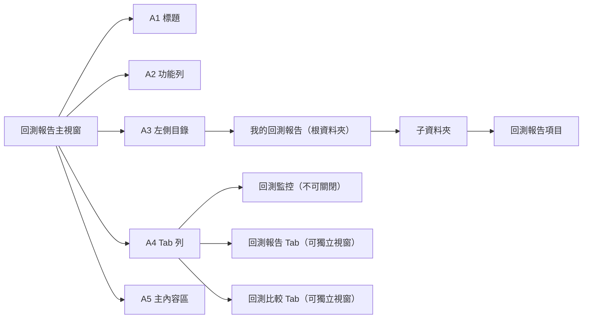

# PRD 05 — 回測報告：回測報告介面

> **版本**：v1.0 | **日期**：2026-03-11 | **狀態**：Draft
> **原始 Spec**：`docs/reference/pdf-convert/回測報告-回測報告介面-Spec.md`

---

## 1. 整體架構

### 1.1 入口

- 新增入口：**XQ → 策略 (D) → 回測報告**

### 1.2 版面區域

| 區域 | 說明 |
|------|------|
| A1 | **標題**：「回測報告」+ XQ 版本名稱，例：「回測報告 XQ全球贏家(個人版)」 |
| A2 | **功能列**：匯入回測報告、說明連結（?）、縮小 / 放大 / 關閉 |
| A3 | **左側目錄**：Search 搜尋、資料夾管理、回測報告清單 |
| A4 | **Tab 列**：回測監控（固定第一個）+ 各回測報告 Tab + 回測比較 Tab |
| A5 | **主內容區**：回測監控 / 回測報告詳細內容 |



> 📐 **前端 Prototype 規劃（Vite）**
> - 主元件：`BacktestReportApp.jsx`
> - 子元件：`SidebarTree.jsx`、`TabBar.jsx`、`MonitorPanel.jsx`
> - Tab 拖曳：使用 `dnd-kit` 或 `react-dnd` 實作
> - 參考圖：`回測報告介面-Spec_png/_page_0_Figure_1.jpeg`（僅供視覺參考，不可修改）

---

## 2. A2 功能列規格

| 功能 | 說明 |
|------|------|
| 匯入回測報告 | 下拉式選單：「匯入 BTReportNew」、「匯入 csv」 |
| 說明（?）| 點擊後開啟網頁瀏覽器，連結至對應平台官網說明頁面 |
| 縮小 / 放大 / 關閉 | 關閉時若有未儲存的回測報告 Tab，詢問是否儲存後再關閉 |
| 儲存方式 | 永久保存於本機硬碟，不限數量，無自動刪除期限 |

---

## 3. A3 左側目錄規格

### 3.1 Search 搜尋

- 輸入關鍵字後，篩選名稱**部分符合**的回測報告或資料夾
- 點擊「+」可新增資料夾

### 3.2 資料夾管理

| 操作 | 說明 |
|------|------|
| 展開 / 收合 | 點擊資料夾名稱切換 |
| 名稱後方數量標示 | 顯示該資料夾內含的回測報告數量 |
| 最上層資料夾 | 固定為「我的回測報告」 |

**「我的回測報告」右鍵選單**：
- 新增子資料夾（可自訂名稱）
- 開啟所有回測報告

**子資料夾右鍵選單**：
- 新增子資料夾
- 重新命名
- 移動（移動所有項目至其他資料夾）
- 刪除（若內含報告，彈出提示並提供「移動」或「刪除」選項）

### 3.3 回測報告項目操作

| 操作 | 行為 |
|------|------|
| 左鍵快速雙擊 | 開啟回測報告 Tab（Tab 已存在則切換到該 Tab）|
| 左鍵慢速雙擊 | 進入重新命名模式（同步更新 Tab 名稱、回測監控名稱、報告標題）|
| 左鍵按住拖曳 | 移動到其他資料夾，或拖曳至垃圾桶刪除 |
| 右鍵 → 開啟 | 開啟回測報告 Tab |
| 右鍵 → 重新命名 | 同步更新 Tab 名稱、監控名稱、報告標題 |
| 右鍵 → 移動 | 跳出目錄選單，指定目標資料夾 |
| 右鍵 → 刪除 | 僅刪除目錄中的項目，**不影響已開啟的 Tab** |

---

## 4. A4 Tab 列規格

| Tab 類型 | 說明 |
|---------|------|
| 回測監控 | 固定在第一個 Tab，**無法關閉、無法拖曳獨立** |
| 回測報告 | 名稱預設為報告標題，可修改；關閉時詢問是否儲存；可拖曳獨立 |
| 回測比較 | 名稱預設為「回測比較-編號」，可修改；關閉**不詢問**；可拖曳獨立 |

---

## 5. A5 主內容區：回測監控

| 欄位 | 說明 |
|------|------|
| 回測報告 | 報告標題名稱 |
| 來源 | 選股中心 / 策略雷達 / 自動交易 / 手動匯入 |
| 執行時間 | 回測開始執行的時間 |
| 執行進度 | 百分比進度條；失敗時顯示紅字「回測失敗」 |
| 狀態 | ✅ 成功 / ▶️ 執行中 / ⏸️ 暫停中 / ❌ 失敗 |

**狀態說明**：
- ✅：成功後自動開啟回測報告 Tab，回測監控列保留 **1 分鐘**後自動移除

**操作按鈕**：
- **暫停**：點擊後暫停，文字改為「繼續」
- **刪除**：確認提示後，從回測監控移除
- **重新回測**：視同重跑整份回測

> 📐 **前端 Prototype 規劃（Vite）**
> - 元件：`BacktestMonitorList.jsx`
> - 功能：顯示回測任務清單、進度條動畫、狀態圖示
> - 自動移除：成功後 60 秒以 `setTimeout` 移除列表項目

---

## 6. 回測報告置頂區

置頂區**固定顯示**在最上方，向下滾動時會縮小，但保留關鍵資訊。

### 6.1 置頂區完整狀態（A 區）

| 子區域 | 說明 |
|--------|------|
| A1 策略標題 | 格式：`[平台]:策略名稱`，例：「自動交易 DIF-MACD 從負翻正回測報告」；點擊鉛筆圖示可編輯 |
| A2 功能按鈕 | 備註（側邊記事本）、匯出、重新回測 |
| A3 計算設定 | 交易數量下拉、報酬率算法下拉、數據篩選 |
| A4 腳本設定簡要 | — |
| A5 重點資訊 | — |

### 6.2 A3 計算設定詳細規格

**交易數量下拉**：
- 選項：「腳本」（僅自動交易）、「等量」、「等額」、「等比」
- 切換後**重新計算**整份回測報告
- 切換至「等比」時，回到預設「整體統計」頁面；其餘維持在切換前的頁面

**報酬率算法下拉**：
- 選項：「時間加權報酬率（TWRR）」、「最大投入報酬率（MIR）」、「金額加權報酬率（MWRR）」
- 「等比」模式強制鎖定 TWRR，MIR 與 MWRR 均不可選（灰底不可點擊）
- MWRR 僅在交易數量為「腳本」、「等量」或「等額」時可用

**數據篩選**：
- 選股中心、策略雷達：只顯示策略參數設定的方向
- 自動交易：可選「全」、「多」、「空」（預設「全部」）；篩選後**整個報表（表格與圖形）**都受影響
  - 在「多」或「空」下，報酬率圖以虛線或淡色提供「全部」參考線

**其他資訊**：
- 回測日期：回測執行的範圍區間
- 成功商品數（藍字）：點擊跳轉至商品統計頁籤
- 失敗商品數（紅字）：點擊彈出錯誤資訊表格（欄位：商品名稱 / 狀態 / 說明），並提供「針對失敗商品重新回測」按鈕

### 6.3 向下滾動後置頂區縮減

隱藏表格，僅保留：
- 標題
- 交易數量、報酬率算法、數據篩選
- 回測日期
- 重點資訊
- 功能按鈕
- 頁籤

> 向上滑動即可顯示完整表格，**不需要滑到頁面頂端**。

> 📐 **前端 Prototype 規劃（Vite）**
> - 元件：`StickyHeader.jsx`
> - 功能：使用 `IntersectionObserver` 偵測滾動位置，動態切換完整 / 精簡模式
> - 圖：`回測報告介面-Spec_png/_page_2_Figure_6.jpeg`（視覺參考）

---

## 7. 頁籤系統（Tab）

- 預設顯示：**整體統計**
- 當前頁籤：粗體藍字 + 底線

| Tab | 說明 |
|-----|------|
| 整體統計 | 報酬率曲線圖 + 每日報表 |
| 交易統計 | 報酬分佈、持倉效率等圖表 |
| 週期分析 | 日 / 月 / 季 / 年頻率分析 |
| 因子分析 | 因子分組統計 |
| 商品與交易 | 商品統計表 + 交易紀錄 |
| 交易設定 | 本次回測的參數設定與腳本（細節見 [PRD 04 §4](./04-回測設定.md#4-回測報告-ui-上顯示的回測參數)）|

---

## 8. 整體統計頁（Tab 1）

### 8.1 圖形區

| 子區域 | 說明 |
|--------|------|
| A1 主圖 | 策略淨利（固定顯示，Y 軸）+ 策略報酬率（固定顯示，X 軸）+ 參考指標（可設定）|
| A2 參考指標設定 | 點擊「…」彈出商品列表，最多加入兩個；勾選 checkbox 決定是否顯示；暫存於清單中不需重設 |
| A3 副圖 | 資料來源為每日報表欄位 |
| A4 共用查價線 | 主圖與副圖共用查價線及日期標籤 |
| A5 時間軸 | 可彈性調整顯示區間 + 快捷鍵切換 |
| A6 欄位統計 | 依欄位分類可收合，同時顯示所有單位 |

**預設參考指標**：「大盤指數報酬率」、「買進持有報酬率」、「0050（台灣 50）」

### 8.2 每日報表

- B1 表格：欄位參考每日報表欄位，預設**日期遞減**排序，點擊欄位名稱可循環排序（遞減 → 遞增 → 取消）
- B2 交易筆數（藍字）：點擊可切換到交易分析頁面，依日期篩選出當日交易

> 📐 **前端 Prototype 規劃（Vite）**
> - 元件：`OverallStatsTab.jsx`、`ReturnChart.jsx`、`DailyReportTable.jsx`
> - 圖表庫：建議使用 `Recharts` 或 `ECharts`
> - 圖：`回測報告介面-Spec_png/_page_4_Figure_7.jpeg`、`_page_5_Figure_2.jpeg`（視覺參考）

---

## 9. 交易統計頁（Tab 2）

### 9.1 圖形區

| Tab | 圖表類型 | 軸說明 | Hover Tooltip |
|-----|---------|--------|--------------|
| Tab 1：報酬分佈 | 直方圖 | X 軸：報酬區間（% / $）；Y 軸：交易次數；虧損柱體綠色，獲利柱體紅色 | 區間、筆數、佔比 |
| Tab 3：持倉效率 | 散佈圖 | X 軸：持倉 K 線根數；Y 軸：報酬率（% / $）| 股票代碼、進場日、報酬率、損益金額、持倉天數 |

### 9.2 欄位區

- 依欄位分類，可收合
- 同時顯示所有單位

> 📐 **前端 Prototype 規劃（Vite）**
> - 元件：`TradeStatsTab.jsx`、`ReturnDistributionChart.jsx`、`HoldingEfficiencyChart.jsx`
> - 圖：`回測報告介面-Spec_png/_page_6_Figure_1.jpeg`（視覺參考）

---

## 10. 週期分析頁（Tab 3）

| 控制項 | 說明 |
|--------|------|
| A1 頻率切換 | 「日」、「月」、「季」、「年」 |
| A2 圖形區 | 依所選頻率顯示對應的長條圖 |
| A3 表格 | 依所選頻率切換欄位名稱文字（日 / 月 / 季 / 年）|

### 各頻率說明

| 頻率 | 說明 |
|------|------|
| 日 | 1日～31日（依日）；星期一～五（依工作日）；每一日（全區間依日切割）|
| 月 | 1月～12月；每一月；熱力圖（縱軸年份 × 橫軸月份，含平均月報酬率、月勝率）|
| 季 | Q1～Q4；每一季（Q1: 1-3月, Q2: 4-6月, Q3: 7-9月, Q4: 10-12月）；熱力圖（含平均季報酬率、季勝率）|
| 年 | 每一年；熱力圖（橫軸年份，含平均年報酬率、年勝率）|

> 📐 **前端 Prototype 規劃（Vite）**
> - 元件：`PeriodAnalysisTab.jsx`、`HeatmapChart.jsx`、`PeriodBarChart.jsx`
> - 圖：`回測報告介面-Spec_png/_page_7_Figure_2.jpeg`（視覺參考）

---

## 11. 因子分析頁（Tab 4）

| 區域 | 說明 |
|------|------|
| A 因子設定 | 預設一個選項（如：股本）；點擊放大鏡彈出 XS 函數清單視窗；記憶常用因子 |
| B1 累積報酬率圖 | 報酬率 / 淨利切換；查價線顯示日期與各組當日累積報酬率；不需副圖或參考指標 |
| B2 圖形控制 | 顯示各組最終累積報酬率；固定顯示原策略線；預設顯示 D1 和 D10 |
| C 表格 | 固定群組遞增排序，原策略固定第一列 |

**表格欄位**：
分組、樣本數、累計報酬率（熱力圖呈現）、平均單筆報酬、勝率、最大區間虧損、日標準差、Beta、夏普比率、索提諾比率、Alpha

**群組計算步驟**：
1. 依報告的商品範圍及回測區間，計算每日因子數值
2. 依照因子值**等分為 10 組**
3. 將交易紀錄依**進場時間時的組別**分組
4. 每組視為一個獨立回測報告重新統計

> ⚠️ **Spec 說明**：若搜尋不到 XS 函數腳本，顯示：「此 XS 函數腳本已被刪除，請重新選擇腳本。」

> 📐 **前端 Prototype 規劃（Vite）**
> - 元件：`FactorAnalysisTab.jsx`、`FactorGroupTable.jsx`、`FactorReturnChart.jsx`
> - 圖：`回測報告介面-Spec_png/_page_9_Figure_1.jpeg`（視覺參考）

---

## 12. 商品與交易頁（Tab 5）

### 12.1 切換與篩選

| 控制項 | 說明 |
|--------|------|
| A1 切換 | 「商品統計」/ 「交易紀錄」|
| A2 / B1 篩選標籤 | 進階篩選條件顯示於此；商品統計不顯示交易紀錄的篩選條件 |
| A6 / B4 進階篩選 | 可用任意欄位（除商品名稱外）設定條件，支援 OR / AND，可設定大於 / 小於 / 介於等區間 |

### 12.2 商品統計表（A3）

- 搜尋框：可輸入文字或使用下拉式選單
- 點擊商品名稱：切換右側商品資訊（A7）
- 右鍵：商品功能選單
- 標題列 checkbox：全選 / 取消全選
- 預設排序：商品名稱遞增，每次只能排序一個欄位

### 12.3 快速預覽（A4 / B2）

當 checkbox 有勾選時顯示：
- **商品統計**：總報酬率、平均報酬率、勝率、總交易次數
- **交易紀錄**：總報酬率、平均報酬率、勝率、總商品數

### 12.4 勾選功能（A5 / B3）

| 功能 | 適用 |
|------|------|
| 加入自選 | 商品統計、交易紀錄均可 |
| 重新統計 | **僅商品統計**，將勾選商品於交易紀錄篩選後重新統計，彈出新 Tab |

### 12.5 篩選選項

- **全部 / 賺錢 / 賠錢**：僅交易紀錄
- **日期篩選**：僅交易紀錄；可從每日報表點擊帶入
- **進階篩選**：商品統計只受商品統計欄位影響；交易紀錄先篩商品後再篩交易欄位

### 12.6 交易紀錄特殊欄位

- **區間最高價**：該筆交易進出場期間的最高價
- **區間最低價**：該筆交易進出場期間的最低價

### 12.7 商品資訊側面板（A7）

- 點擊「+」加入自選
- 顯示商品最新股價資訊
- 單商品統計重點資訊
- 下半部：報酬率圖、K 線交易走勢圖

### 12.8 單商品圖（A8）

| 圖表 | 說明 |
|------|------|
| 報酬率圖 | 同整體統計的參考指標設定；下方顯示近期統計報酬率 |
| K 線交易圖 | 標注進出場訊號；可加入一條自訂均線；下方顯示交易明細卡片 |

> 📐 **前端 Prototype 規劃（Vite）**
> - 元件：`ProductTradeTab.jsx`、`ProductStatsTable.jsx`、`TradeRecordTable.jsx`、`ProductDetailPanel.jsx`、`KLineChart.jsx`
> - 篩選：使用 `react-table` 或自建篩選邏輯
> - 圖：`回測報告介面-Spec_png/_page_10_Figure_5.jpeg`、`_page_10_Figure_6.jpeg`、`_page_12_Figure_0.jpeg`、`_page_13_Figure_1.jpeg`、`_page_14_Figure_6.jpeg`（視覺參考）

---

## 13. 交易設定頁（Tab 6）

> 📌 **完整規格請見 [PRD 04 §4 回測報告 UI 上顯示的回測參數](./04-回測設定.md#4-回測報告-ui-上顯示的回測參數)**
> 為避免「回測設定」相關內容於兩份 PRD 重複維護，Tab 6 的 A 區設定資訊、B 區腳本資料、欄位顯示對照表已集中至 PRD 04。本節僅保留 Tab 6 在報告系統中的位置定義。

### 13.1 在報告系統中的定位

| 項目 | 說明 |
|------|------|
| 入口 | 回測報告詳細頁 → Tab 6「交易設定」 |
| 區塊組成 | A 區「設定資訊」 + B 區「腳本資料」（細節見 PRD 04 §4.2、§4.3）|
| 對應元件 | `TradeConfigTab.jsx`、`ScriptViewer.jsx` |
| 視覺參考 | `回測報告介面-Spec_png/_page_14_Figure_13.jpeg`（僅供視覺參考，不可修改）|
| 程式碼高亮 | 建議使用 `Prism.js` 或 `highlight.js` |

---

## 14. User Story 總覽

```
作為使用者，
我希望能在置頂區快速切換交易數量類型與報酬率算法，
並即時看到回測報告重新計算後的結果，
以便快速比較不同計算方式的差異。
```

```
作為使用者，
我希望在商品統計表中勾選特定商品後，能一鍵重新統計，
以便針對績效較好的商品群組進行深入分析。
```

```
作為使用者，
我希望在交易設定 Tab 中看到本次回測使用的所有腳本設定，
並能直接複製腳本程式碼，
以便進行後續修改或分享。
```
