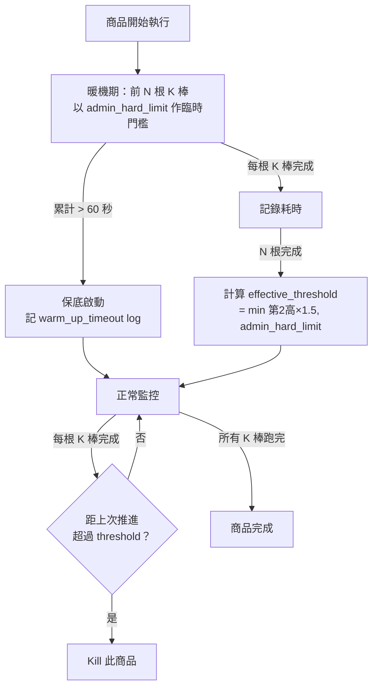
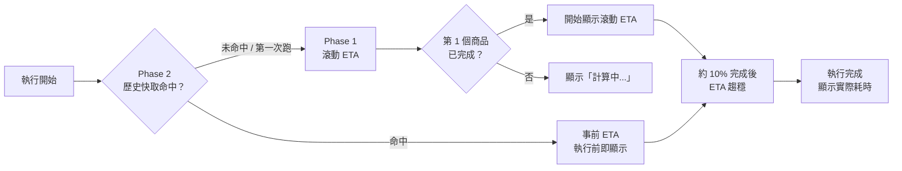
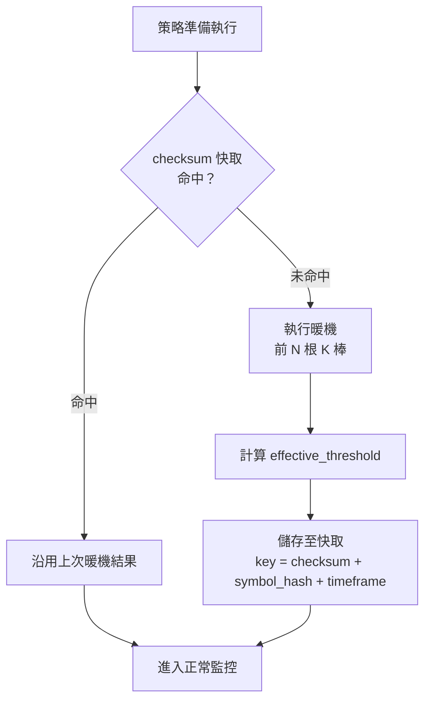
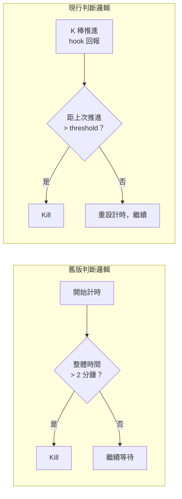
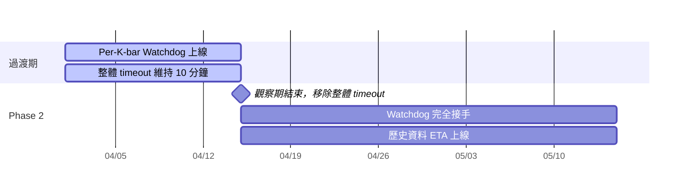

# 設計調整對照說明（會議討論版）

**對照來源**：左欄 = `Probe Phase 設計.md`（舊）　｜　右欄 = `根本解法_回測執行時間預估模型_討論.md`（現行討論版）

---

## 【重點討論①】商品預估值（Per-Instrument Estimation）

### 門檻計算

| 項目 | 舊版（Probe Phase）| 現行討論版 |
| :--- | :--- | :--- |
| **基準值** | `avg_bar_time`（暖機平均值）| 暖機 N 筆中**第 2 高**的耗時 |
| **緩衝乘數** | × 2 | × 1.5 |
| **公式** | `avg × 2` | `min(第 2 高 × 1.5, admin_hard_limit)` |
| **全域上限** | 未提及 | `admin_hard_limit`（建議 30 秒/棒）|

> **為何改用第 2 高 × 1.5**：平均值在訊號棒計算量暴增時會低估，易誤殺；第 2 高明確排除單次異常，配合較小乘數緩衝，語義更清楚。

### 暖機範圍

| 項目 | 舊版 | 現行討論版 |
| :--- | :--- | :--- |
| **暖機對象** | 從整批中抽取 10 檔探針商品，結果套用全部 | 每個商品自己的前 N 根 K 棒，只套用於該商品 |
| **結果用途** | 推算整批安全 concurrency 數 | 設定該商品後續 K 棒的卡死偵測門檻 |
| **N 值** | 「例如 10 根」（非正式）| 決議 N = 10；K 棒 < N 的邊界情況與動態 N 方案仍為待決議項 |
| **暖機期間保護** | 未提及 | 60 秒保底 → 改用 `admin_hard_limit`；觸發後記 `warm_up_timeout` log，繼續執行（不 kill）|



---

## 【重點討論②】整體策略預估值 / ETA

### ETA 計算方式

| 項目 | 舊版 | 現行討論版 |
| :--- | :--- | :--- |
| **ETA** | 未提及 | Phase 1 滾動 ETA（`已完成平均耗時 × 剩餘數`）；Phase 2 歷史資料事前 ETA |
| **初期體驗** | 未提及 | 第 1 個商品完成前顯示「計算中...」；約 10% 完成後才趨穩 |
| **歷史資料格式** | 未提及 | `strategy_checksum + symbol_list_hash + timeframe → elapsed_sec`（每商品）|
| **商品清單異動** | 未提及 | symbol_list_hash 改變 → 快取 miss → 降級為滾動 ETA |



### 機器分配效能（棄用 Probe Phase 後的差異）

| 項目 | 舊版（Probe Phase）| 現行討論版（Watchdog）|
| :--- | :--- | :--- |
| **配置時機** | 探針跑完後立即可配置（事前）| Phase 1 靠滾動 P95 動態調整（事後）；Phase 2 歷史資料才補回事前能力 |
| **批次 throughput** | 需等探針完成才派後續批次（有延遲）| 直接全派，無前置等待，理論更快 |
| **初期機器空閒率** | 事前限制 concurrency，利用率穩定 | 前幾台完成前排程器是盲的，可能多開機器 |
| **空白期保底** | 不需要（Probe 完成即有估算）| **待確認**：Phase 1 是否需要最小保底機器數？ |

```mermaid
flowchart TD
    subgraph 舊版：Probe Phase
        direction LR
        A1[開始] --> B1[先跑探針\n10 檔]
        B1 --> C1[P95 耗時]
        C1 --> D1[safe_concurrency\n= floor 120÷P95]
        D1 --> E1[依上限派送\n剩餘商品]
    end
    subgraph 現行：Watchdog
        direction LR
        A2[開始] --> B2[直接全派]
        B2 --> C2[各商品自行暖機]
        C2 --> D2[滾動 P95 回饋]
        D2 --> E2[動態調整\n後續派送速率]
    end
```

### 快取機制

| 項目 | 舊版 | 現行討論版 |
| :--- | :--- | :--- |
| **失效方式** | TTL（值待 RD 評估）| 策略邏輯 checksum 作為 key，邏輯不變則永久有效 |
| **微幅修改** | 未討論 | 改名稱、備註不觸發失效；僅影響計算的邏輯/參數改動才換 key |
| **命中體驗** | 未討論 | 命中 → Phase 2 可在執行前顯示事前 ETA；未命中 → 降級為滾動 ETA |



---

## 核心解法定位

| 項目 | 舊版 | 現行討論版 |
| :--- | :--- | :--- |
| **解法主軸** | Probe Phase 為主，Per-K-bar 為「長期方向」一句帶過 | Per-K-bar Watchdog 為主，Probe Phase 不需要 |
| **Probe Phase 的角色** | 決定整批的安全 concurrency 上限 | 不需要（Watchdog 個別保護；效能預測由 Phase 2 補回）|
| **Timeout 判斷依據** | 整體執行時間上限（2 分鐘/商品）| 每根 K 棒的推進間隔（K 棒還在推進就不 kill）|
| **Watchdog 定義** | 條列為 RD 實作項目，未說明 | Per-K-bar = 判斷策略；Watchdog = 排程器側的監控元件 |



---

## 過渡方案

| 項目 | 舊版 | 現行討論版 |
| :--- | :--- | :--- |
| **整體 timeout** | 維持 2 分鐘不動 | Phase 1 調大至 10 分鐘作保險；觀察 2 週穩定後移除 |
| **admin_hard_limit** | 有提但未設值 | 建議初始值 30 秒/根 K 棒 |


