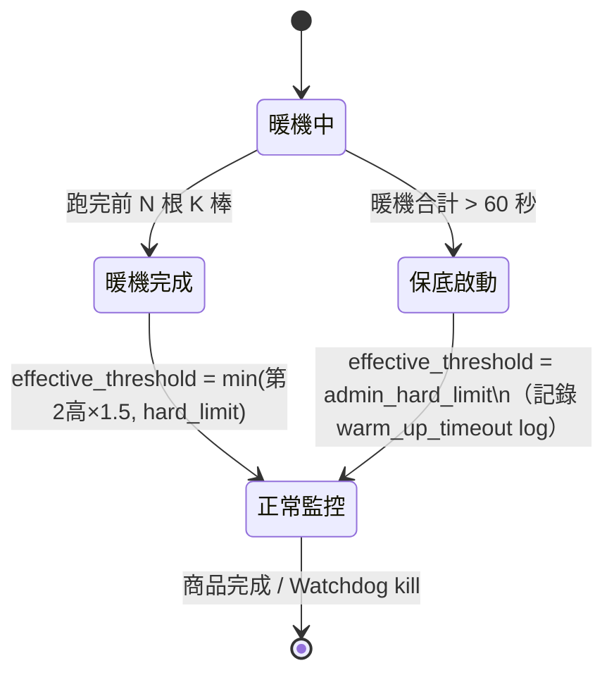
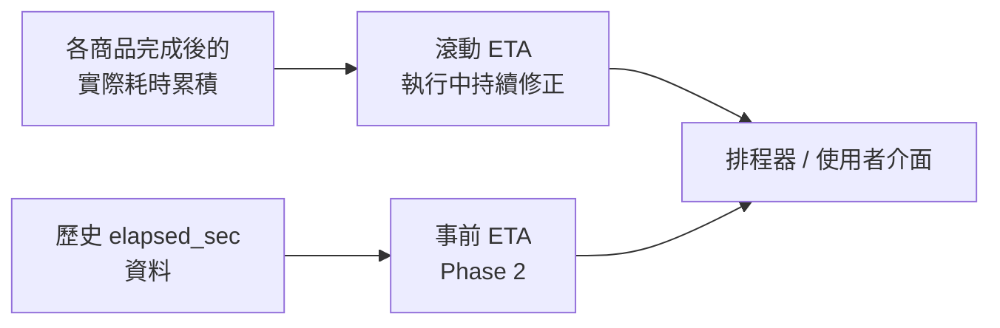
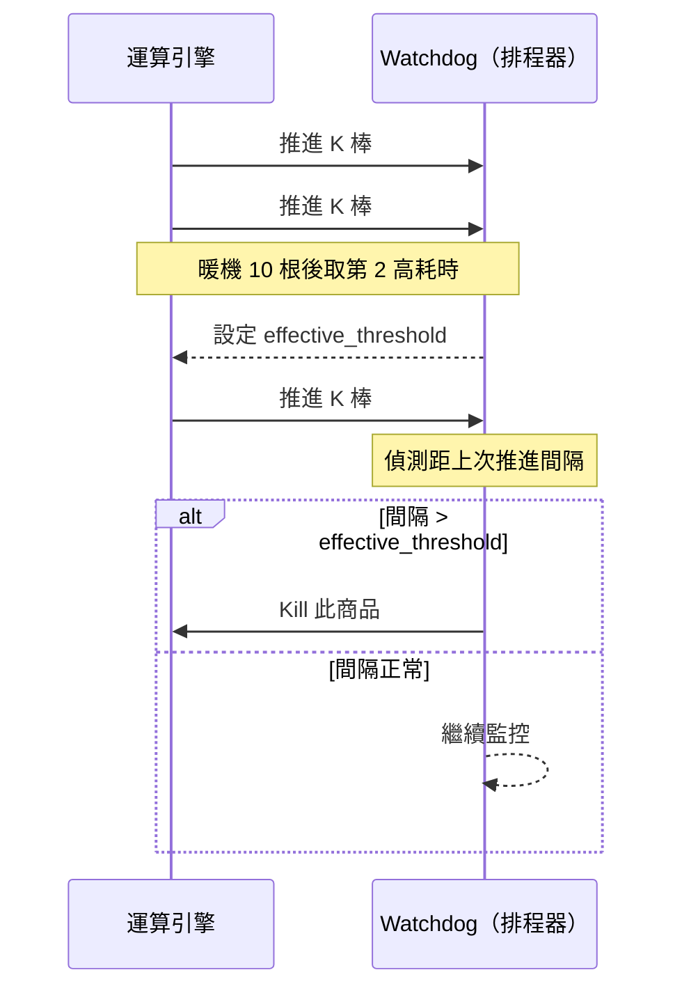

# 根本解法：回測執行時間預估模型（討論文件）

**日期**：2026-03-28　　**狀態**：討論草稿　　**作者**：PM

> **本文件目的**：針對「根本解法」進行深度討論，引導 RD 與 PM 釐清設計決策。Probe Phase、VIP 分配、接續回測等方案僅作為背景脈絡，不在本文件討論範圍。

---

## 一、問題重新定義

### 現行機制的根本缺陷

目前以「**整體執行時間 ≤ 2 分鐘**」作為 timeout 判斷標準，本質上混淆了兩種完全不同的狀態：

| 狀態 | 描述 | 正確處置 |
| :--- | :--- | :--- |
| **計算量重** | K 棒數多、策略計算複雜，需要的時間本來就長 | **不該 kill**，應給予足夠時間 |
| **真正卡死** | 卡在同一根 K 棒不推進，陷入無窮迴圈 | **應立即 kill** |

固定 2 分鐘上限無法區分兩者，導致「合理但耗時的計算」被誤殺，而「真正卡死的商品」在 2 分鐘內照樣佔據資源。

### 執行模型說明

> 每個商品從第一根 K 棒跑到最後一根才結束，期間不會與其他商品交錯。系統同時跑多個商品，是靠**多台機器並行**（每台機器負責一個商品），而非單台機器同時處理多個商品。
>
> 因此，商品間沒有資源競爭，timeout 的根本原因只有兩種：這個商品本身計算量重，或是真的卡死。

### 根本解法的核心轉變

> 從「**時間上限（Time Limit）**」→ 改為「**推進狀態偵測（Progress Detection）**」

判斷依據從「跑了多久」改為「K 棒是否還在往前推進」。只要 K 棒還在推進，就代表計算正在進行，不應 kill；真正沒有推進才算卡死。

---

## 二、商品預估值（Per-Instrument Estimation）

### 核心概念

在一個商品開始跑的當下，**動態估算這個商品的每根 K 棒平均耗時**，作為後續偵測卡死的判斷門檻依據。

```
每根 K 棒容忍時間（effective_threshold）= min(第 2 高的暖機耗時 × 1.5, admin_hard_limit)
```

### 暖機取樣機制

> **暖機發生的時機**：不是所有商品統一暖機，而是每個商品**輪到它跑的時候**才開始暖機。第 1 個商品開始執行時才暖機，跑完換第 2 個商品時，第 2 個商品再自己暖機，以此類推。因此執行前拿不到任何暖機資料。

由於每根 K 棒的耗時無法事先得知，採用**暖機（warm-up）**方式，讓商品先跑幾根 K 棒再設定門檻：

```
1. 先跑前 N 根 K 棒（建議 N = 10）
2. 收集每根 K 棒的執行耗時，從短到長排列
3. 取第 2 高的耗時作為基準
   （排除最高那 1 筆，避免單次異常尖峰拉高門檻）
4. dynamic_threshold = 第 2 高的耗時 × 1.5
5. effective_threshold = min(dynamic_threshold, admin_hard_limit)
6. 後續每根 K 棒：距上次推進超過 effective_threshold → kill
```

> **為什麼用「第 2 高 × 1.5」，而不是平均值 × 2 或 P95 × 1.5？**
> - **平均值 × 2**：策略在訊號觸發的那根 K 棒計算量可能是一般棒的數倍，平均值會低估這類尖峰，容易誤殺。
> - **P95（10 筆資料）**：10 筆取 P95 等於「最大值和次大值的平均」，在統計上沒有意義，實際就是接近最大值。
> - **第 2 高**：明確排除最高那 1 筆（可能是初始化或單次異常），用剩下最重的情況作為基準，再乘 1.5 緩衝，語義清楚且適合小樣本。

### 暖機期間的 Watchdog 行為

暖機完成前（前 N 根 K 棒），`effective_threshold` 尚未計算出來，Watchdog 仍需對這段期間提供保護：

```
暖機期間（第 1 ～ N 根 K 棒）：以 admin_hard_limit 作為臨時門檻
暖機完成後（第 N+1 根起）：切換為 effective_threshold = min(第 2 高 × 1.5, admin_hard_limit)
```

> 暖機期間觸發 kill 代表商品連「最寬鬆的上限」都跑不過，幾乎確定是卡死。

**暖機保底機制（60 秒）**：若暖機 10 根合計超過 60 秒仍未完成，觸發保底：
- 停止等待，直接以 `admin_hard_limit` 作為 `effective_threshold`
- 記錄 `warm_up_timeout = true` 至 log，供後續分析（該商品為何計算量極重）
- 正常繼續執行，不 kill



### N 值的選擇（待討論）

目前決議 N = 10，但存在幾個邊界情況值得討論：

**情境 1：K 棒總數 < N（例如只有 5 根 K 棒）**

| 方案 | 說明 | 優點 | 缺點 |
| :--- | :--- | :--- | :--- |
| **固定 N=10（現行）** | 若 K 棒 < 10，暖機跑完就結束，無後續監控對象 | 實作最簡單 | 少棒商品等同沒有 Watchdog 保護 |
| **動態 N = min(10, total / 2)** | 根據 K 棒總數自動縮減取樣數 | 行為一致，語義合理 | 需在執行前取得 total K 棒數 |
| **統計穩定收斂** | 持續暖機直到耗時方差低於閾值 | 理論上最準確 | 實作複雜，不保證何時收斂 |

> **PM/RD 待決議**：多數策略 K 棒數遠超 10 根，此情境是否為 edge case 留待 Phase 1 觀察？或先以「動態 N」方案避免日後討論？

**情境 2：N 值對取樣精準度的影響**

N = 10 是小樣本，取到的「第 2 高」可能受偶發性尖峰影響。若 N 調大（如 20），取樣更穩定但暖機本身耗費更長時間。

> 建議：Phase 1 先以 N = 10 上線，收集實際暖機耗時後評估是否調整。

---

## 三、整體策略預估值（Strategy-Level Estimation）

### 核心概念

「整體策略預估值」的主要用途是估算整批完成所需的時間（ETA），以及描述這批商品整體的計算重量，供排程器預留適當機器數。

> **ETA（Estimated Time of Arrival，預計完成時間）**：預估整批商品全部跑完需要多久，顯示給使用者看，讓他們知道大概要等多久。

### ETA 的設計矛盾

由於暖機在執行中才發生，**執行開始前拿不到任何商品的耗時資料**，這造成了 ETA 的設計矛盾：

| 做法 | 說明 | 問題 |
| :--- | :--- | :--- |
| **滾動 ETA**（執行中估算）| 等第一批商品完成後，用實際耗時推算剩餘商品；隨執行進度持續修正 | 使用者在執行初期看不到任何數字 |
| **事前 ETA**（歷史資料估算）| 用過去跑過的 `elapsed_sec` 歷史資料，在執行開始前就給出估計值 | 沒有歷史資料的策略（第一次跑）估不了 |

兩種做法可以互補：**Phase 1 先實作滾動 ETA**（只要 Watchdog 完成即可取得資料），**Phase 2 再疊加歷史資料估算**，提供第一次跑時的事前 ETA。

### 滾動 ETA 的計算細節

**計算公式**：

```
rolling_ETA = 已完成商品平均耗時 × 剩餘商品數
```

> **簡化假設**：以已完成商品的平均耗時作為剩餘商品的代理值。此假設在商品計算複雜度相近時合理；若策略含少數極重商品，滾動 ETA 可能低估。

**使用者體驗的時間軸**：

| 時機 | 使用者看到的內容 |
| :--- | :--- |
| 執行開始，第一個商品尚未完成 | 「計算中...」（spinner 或進度條，無數字）|
| 第 1 個商品完成後 | 開始顯示 ETA，但僅基於 1 筆樣本，精準度低 |
| 約 10% 商品完成後 | ETA 趨於穩定，準確性明顯提升 |
| 執行完成 | 顯示實際耗時 |

> **PM 注意**：使用者在執行初期（第一個商品完成前）完全看不到數字，這是 Phase 1 的體驗限制。Phase 2 引入歷史資料後，可在執行開始前就給出估計值，解決此問題。

### 為什麼用 P95 描述「這批有多重」

> **P95（第 95 百分位數）**：把所有商品的預估時間從短到長排列，取「排在第 95% 位置」的那個值。代表「最重的那 5% 商品有多重」。

P95 在這裡不是用來設定機器層級的並行數（每台機器固定跑 1 個商品），而是描述「這批商品的重量級分布」，讓排程器判斷需要預留多少機器、ETA 大概落在哪個區間。剩下那 5% 更重的商品，Per-K-bar Watchdog 會個別保護。

**Phase 1 的 P95 計算時機**：

由於執行前沒有資料，Phase 1 的 P95 是從**已完成商品的 `elapsed_sec`** 滾動計算，隨執行進度持續更新。僅供排程器調整機器數，不直接顯示給使用者。

```
P95（滾動）= 從已完成商品 elapsed_sec 列表中，取第 95 百分位數
```

> 商品數量少於 20 筆時，P95 統計上意義有限（等同最大值附近），排程器可退化為以最大值估算。

### 棄用 Probe Phase 後的機器分配效能評估

Probe Phase 同時解決了兩件事，但文件只明確說明了第一件：

| Probe Phase 的功能 | Watchdog 的對應 |
| :--- | :--- |
| **安全**：限制 concurrency，讓商品在 2 分鐘內完成，避免誤殺 | ✅ Watchdog 個別偵測，不再需要限制 concurrency |
| **效能**：事前知道這批「有多重」，排程器提前配置適當機器數 | ⚠️ **Phase 1 無法事前知道，只能事後滾動反推** |

**Phase 1 的機器分配策略（無 Probe Phase 情況下）：**

| 時機 | 可用資訊 | 建議策略 |
| :--- | :--- | :--- |
| 執行前 | 無 | 以「最大可用機器數」啟動，不做事前限制 |
| 執行中（前幾台完成後）| 已完成商品的滾動 P95 | 排程器依 P95 動態調整後續派送速率 |
| Phase 2（歷史資料）| 上次相同策略的 `elapsed_sec` | 執行前即可預估，接近 Probe Phase 的事前配置能力 |

**與 Probe Phase 的效能比較：**

| 指標 | Probe Phase | Watchdog（Phase 1）|
| :--- | :--- | :--- |
| 批次完成時間 | 需等探針完成才派後續批次（額外延遲）| 直接全派，無前置等待，**理論 throughput 更好** |
| 機器空閒率 | 事前限制 concurrency，機器利用率較低 | 全派但依 P95 回饋調整，空閒率由實際資料驅動 |
| 首批排程延遲 | Probe Phase 本身就是一批延遲 | 無，立即開始 |
| 執行初期的資源預測準確度 | 高（Probe 跑完即有估算）| 低（前幾台完成前排程器是盲的）|

> **PM/RD 待確認**：Phase 1 上線後，排程器在「第一個商品完成前」的空白期，是否需要一個最小機器預留數作為保底（例如至少開 N 台）？還是允許排程器完全依滾動資料動態決定，初期可能浪費機器？

### 機制分工總覽

| 機制 | 負責的事 | 實作時機 |
| :--- | :--- | :--- |
| **Per-K-bar Watchdog** | 安全：偵測卡死並 kill | Phase 1 |
| **滾動 ETA** | 執行中的進度回饋 | Phase 1（Watchdog 完成後自然可取得資料）|
| **歷史資料估算** | 事前 ETA：執行開始前的預測值 | Phase 2 |

### 資料流



### 快取機制

> **為什麼需要快取？**
> 暖機取樣需要實際執行 N 根 K 棒，有額外時間成本。若同一個策略短期內再跑，可沿用上次的取樣結果，省去重跑暖機的成本。

**快取 key**：策略邏輯的 checksum（對策略的程式碼與參數計算雜湊值）+ 商品清單 hash + 時間週期

**失效機制**：不設 TTL（存活時間），改為 key 自動失效。策略任何影響計算的修改（邏輯、參數）都會產生新的 checksum，對應新的 key；舊 key 的快取自然不再被使用，無需主動清除。

> **為什麼不用 TTL（存活時間）？**
> TTL 是「設一個過期時限，時間到自動清除」。問題是：如果策略沒有改，TTL 到期後仍然要重跑暖機，浪費資源；如果策略改了但 TTL 還沒到，可能用到過期資料。
>
> 改用 checksum 作為 key，策略沒改就永遠用同一個 key，快取一直有效；策略一改，自動換到新 key，舊快取不再被存取，效果等同於失效。這樣既不浪費計算，也不用擔心微幅修改導致快取被強制清除。

### Phase 2 歷史資料格式

Phase 2 事前 ETA 的資料來源是過去執行留下的 `elapsed_sec` 紀錄：

| 欄位 | 說明 | 範例 |
| :--- | :--- | :--- |
| `strategy_checksum` | 策略邏輯+參數的 hash | `sha256(code + params)` |
| `symbol_list_hash` | 本次執行商品清單的 hash | `sha256(sorted symbol list)` |
| `timeframe` | 時間週期（1D / 1H 等）| `1D` |
| `elapsed_sec` | 每個商品的實際總耗時（秒）| `{"AAPL": 12.3, "TSLA": 45.1, ...}` |
| `recorded_at` | 紀錄時間戳 | `2026-03-28T10:00:00Z` |

> **商品清單異動的影響**：若新增/移除商品，`symbol_list_hash` 改變，快取 miss。此時退化為滾動 ETA，僅對「已有歷史紀錄的商品子集」提供參考值（Phase 2 可進一步設計此降級行為）。

### 快取命中 vs 未命中的使用者體驗

| 情境 | Phase 1（滾動 ETA）| Phase 2（含歷史資料）|
| :--- | :--- | :--- |
| **快取命中（跑過同樣策略）** | 執行開始顯示「計算中...」，第 1 個商品完成後才有數字 | 執行開始前立即顯示預估時間（事前 ETA）|
| **快取未命中（第一次跑）** | 同上，無法改善 | 無歷史資料，降級為滾動 ETA，與 Phase 1 行為相同 |

> **PM 注意**：Phase 2 的體驗提升僅對「跑過相同策略+相同商品清單」的情境有效。第一次跑永遠需要等第一個商品完成才能顯示 ETA，這是系統的固有限制。

---

## 四、Per-K-bar Timeout 實作設計

### 系統元件

| 元件 | 位置 | 說明 |
| :--- | :--- | :--- |
| **K 棒推進 hook** | 運算引擎（Calculation Engine）| 每推進一根 K 棒，呼叫 `on_bar_complete(timestamp)` 記錄時間點 |
| **Watchdog** | 排程器（Scheduler）| 監控每根 K 棒間隔，超過 `effective_threshold` 才 kill |
| **admin_hard_limit** | 系統管理設定 | 每根 K 棒的全域最長容忍時間，**建議初始值：30 秒** |

Hook 的侵入性低：引擎只需在 K 棒迴圈裡加一行 callback 呼叫，Watchdog 跑在排程器側，引擎不需要知道 Watchdog 的存在。

### admin_hard_limit = 30 秒的理由

30 秒是最後防線，不是正常運作的門檻：
- 正常策略的 per-bar 耗時通常在毫秒到幾秒之間
- 30 秒已是非常寬鬆的上限，幾乎所有合理策略都不會碰到
- 真正卡死的商品最多 30 秒就會被清除，不會長期佔用機器

### 實作流程



### 與現有整體 timeout 的過渡方案

不建議直接移除現有的 2 分鐘整體 timeout，建議**漸進式切換**：

| 階段 | 整體 timeout | Per-K-bar timeout | 說明 |
| :--- | :---: | :---: | :--- |
| **Phase 1（上線初期）** | 調大至 10 分鐘 | 啟用 | 兩者並存，整體 timeout 作保險 |
| **Phase 2（觀察 2 週穩定後）** | 移除 | 啟用 | Per-K-bar timeout 完全接手 |

過渡期整體 timeout 設 **10 分鐘**：夠大不會誤殺合理策略，夠小不會讓卡死商品長期佔用機器。

---

## 五、待 RD 確認的問題

| # | 問題 | 決議 |
| :--- | :--- | :--- |
| 1 | K 棒推進 hook 在運算引擎中的侵入性如何？ | 預期只需在 K 棒迴圈加一行 callback，待 RD 確認可行性 |
| 2 | 暖機 N 值 | **N = 10**（初步決議），但 K 棒 < N 的邊界情況與動態 N 方案仍待討論（見第二節）|
| 3 | 動態門檻乘數 | **暖機 10 根中第 2 高的耗時 × 1.5**，取代 avg × 2 |
| 4 | `admin_hard_limit` 初始值 | **30 秒 per-bar**，上線後依實測調整 |
| 5 | 整體策略預估值彙總方式 | Phase 1 用 P95 描述重量級分布；ETA 顯示給使用者列為 Phase 2 |
| 6 | 快取失效機制 | **策略邏輯 checksum 作為 key**，不設 TTL，邏輯不變則快取永久有效 |
| 7 | 過渡期整體 timeout 值 | **10 分鐘**，觀察 2 週後移除 |

---

## 六、PM 建議優先順序

1. **先做**：Per-K-bar Watchdog（hook + 偵測機制）+ 整體 timeout 調大至 10 分鐘作保險
2. **同步確認**：hook 侵入性評估（決定實作可行性）
3. **Phase 1 完成後**：觀察 2 週，收集實際 per-bar 時間分布，校準 N 值與乘數
4. **Phase 2**：ETA 顯示給使用者、快取機制、歷史資料估算（排程前預測）
