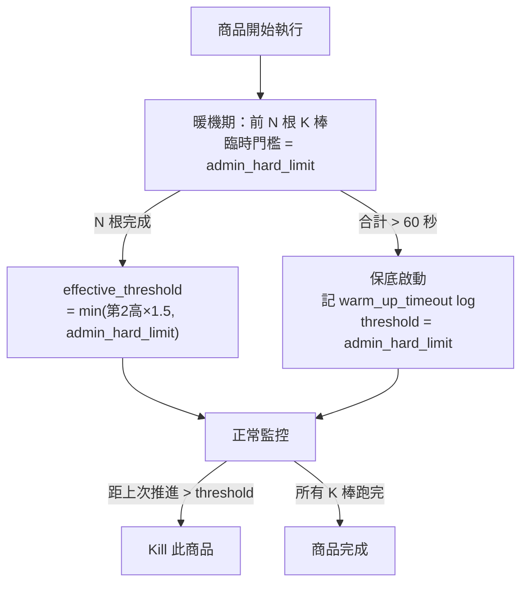
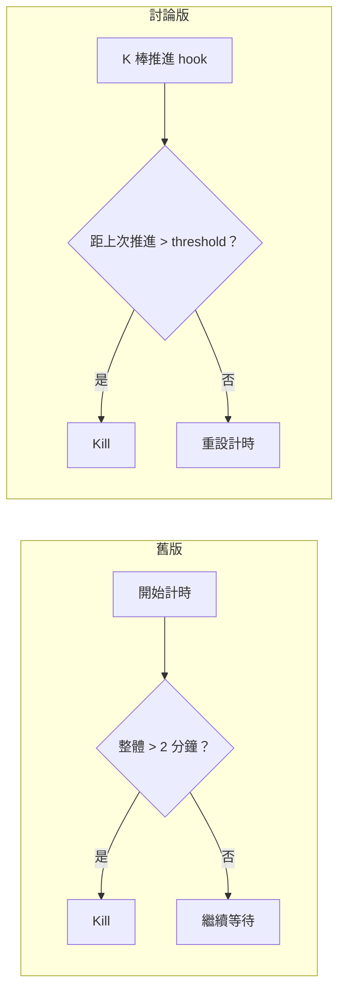

# 設計調整對照說明（會議討論版）

**對照來源**：`Probe Phase 設計.md`（舊版）　vs　`根本解法_回測執行時間預估模型_討論.md`（討論版）

---

## 【討論①】門檻計算方式

| 項目 | 舊版 | 討論版 |
| :--- | :--- | :--- |
| **基準值** | 暖機平均值 `avg_bar_time` | 暖機 N 筆中**第 2 高**耗時 |
| **緩衝乘數** | × 2 | × 1.5 |
| **公式** | `avg × 2` | `min(第2高 × 1.5, admin_hard_limit)` |
| **全域上限** | 未定義 | `admin_hard_limit`（建議 **30 秒/棒**）|

- **關鍵論點**：平均值在訊號棒計算量暴增時會低估，易誤殺；第 2 高排除單次異常且語義明確，搭配較小乘數即足夠。

---

## 【討論②】暖機機制

| 項目 | 舊版 | 討論版 |
| :--- | :--- | :--- |
| **暖機對象** | 抽 10 檔探針商品，結果套用全部 | 每個商品自己前 N 根 K 棒，只套用於該商品 |
| **結果用途** | 推算整批安全 concurrency | 設定該商品的卡死偵測門檻 |
| **N 值** | 非正式提及 10 根 | 決議 **N = 10**；K 棒 < N 的邊界與動態 N 待決議 |
| **暖機期保護** | 未提及 | 以 `admin_hard_limit` 作臨時門檻 |
| **暖機保底** | 未提及 | 合計 > **60 秒**未完成 → 以 `admin_hard_limit` 作為 `effective_threshold`，記 log，不 kill |

---

## 【討論③】核心解法定位

| 項目 | 舊版 | 討論版 |
| :--- | :--- | :--- |
| **解法主軸** | Probe Phase 控制 concurrency | Per-K-bar Watchdog 個別偵測 |
| **Timeout 判斷** | 整體時間上限（2 分鐘/商品）| 每根 K 棒推進間隔 |
| **Probe Phase** | 核心機制 | 不需要（Watchdog 個別保護；效能預測由 Phase 2 補回）|

- **關鍵論點**：固定 2 分鐘無法區分「計算量重」與「真正卡死」；改偵測 K 棒推進狀態才能從根本解決。

---

## 【討論④】ETA 與機器分配

| 項目 | 舊版 | 討論版 |
| :--- | :--- | :--- |
| **ETA** | 未提及 | Phase 1 滾動 ETA（`已完成平均耗時 × 剩餘數`）；Phase 2 歷史資料事前 ETA |
| **初期體驗** | — | 第 1 個商品完成前顯示「計算中...」 |
| **機器配置時機** | 探針跑完後事前配置 | Phase 1 滾動 P95 事後調整；Phase 2 歷史資料補回事前能力 |
| **批次 throughput** | 需等探針完成（有延遲）| 直接全派，無前置等待 |
| **初期盲區** | 無（Probe 完成即有估算）| 前幾台完成前排程器是盲的 |

- **關鍵論點**：棄用 Probe Phase 後 throughput 理論更好，但初期無事前資料。Phase 2 歷史資料可補回事前預測能力。
- **待確認**：Phase 1 是否需要最小保底機器數？

---

## 【討論⑤】快取機制

| 項目 | 舊版 | 討論版 |
| :--- | :--- | :--- |
| **快取 key** | 策略 ID + 商品清單 hash | `strategy_checksum + symbol_list_hash + timeframe` |
| **失效方式** | TTL（值待評估）| checksum 驅動，邏輯不變則永久有效 |
| **微幅修改** | 未討論 | 改名稱/備註不觸發失效，僅計算邏輯變動才換 key |
| **命中效果** | 未討論 | 命中 → Phase 2 事前 ETA；未命中 → 降級為滾動 ETA |

- **關鍵論點**：checksum 取代 TTL，避免「策略沒改卻要重跑暖機」與「策略改了但 TTL 未到」的兩難。

---

## 【討論⑥】過渡方案

| 項目 | 舊版 | 討論版 |
| :--- | :--- | :--- |
| **整體 timeout** | 維持 2 分鐘 | Phase 1 調大至 **10 分鐘**作保險；觀察 2 週穩定後移除 |
| **admin_hard_limit** | 有提但未設值 | 建議初始值 **30 秒/根 K 棒** |

- **Phase 1**：Per-K-bar Watchdog 上線 + 整體 timeout 10 分鐘並存
- **Phase 2**：移除整體 timeout，Watchdog 完全接手 + 歷史資料 ETA 上線
