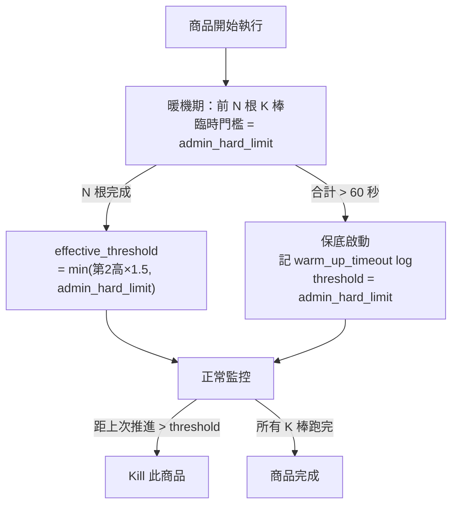
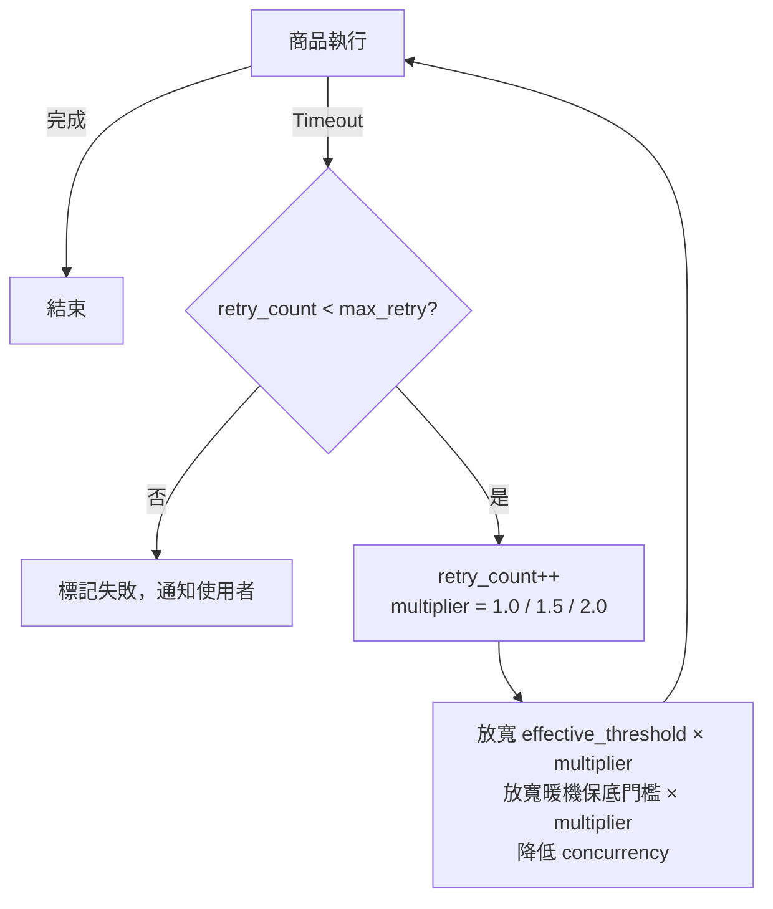

# Per-K-bar Timeout 設計討論（會議版）

**背景**：`Probe Phase 設計.md` 的「長期方向」提出以 **Per-K-bar Timeout** 取代整體 2 分鐘 timeout。本文件聚焦在實作時各子系統的設計決策。

**來源文件**：`根本解法_回測執行時間預估模型_討論.md`

---

## 【討論①】Watchdog 偵測機制

> **核心問題**：如何判斷商品是「計算量重」還是「真正卡死」？

### 偵測方式

- 運算引擎每推進一根 K 棒，呼叫 `on_bar_complete(timestamp)` 記錄時間點
- Watchdog（排程器側）監控相鄰 K 棒的推進間隔
- 距上次推進超過 `effective_threshold` → kill 該商品

### 門檻公式

```
effective_threshold = min(第 2 高暖機耗時 × 1.5, admin_hard_limit)
```

| 參數 | 值 | 說明 |
| :--- | :--- | :--- |
| **基準值** | 暖機 N 筆中第 2 高耗時 | 排除最高 1 筆（可能是初始化異常），用剩下最重的情況 |
| **緩衝乘數** | × 1.5 | 第 2 高已接近實際尖峰，乘數不需太大 |
| **admin_hard_limit** | **30 秒/棒**（建議初始值）| 全域最後防線，正常策略 per-bar 通常在毫秒～幾秒 |

- **為什麼不用 avg × 2**：訊號觸發棒的計算量可能是一般棒的數倍，平均值會低估尖峰，易誤殺

### 暖機取樣（前 N 根 K 棒）

- 暖機期間以 `admin_hard_limit` 作臨時門檻
- 暖機完成後切換為 `effective_threshold`
- **K 棒總數 ≤ N**：不做暖機，直接以 `admin_hard_limit` 作為 `effective_threshold`（棒數太少無法取樣出有意義的門檻）

### 暖機保底機制

| 項目 | 說明 |
| :--- | :--- |
| **觸發條件** | 暖機 10 根合計超過 **60 秒**仍未完成 |
| **行為** | 停止等待，直接以 `admin_hard_limit`（30 秒）作為 `effective_threshold` |
| **記錄** | `warm_up_timeout = true` 寫入 log，供後續分析 |
| **是否 kill** | **不 kill**，正常繼續執行 |

**設計理由**：
- 暖機跑不完 ≠ 卡死，只代表計算量極重（例如每根 7 秒 × 10 根 = 70 秒）→ 不應 kill
- 但不能無限等暖機才設門檻 → 60 秒後放棄精準門檻，改用最寬鬆上限
- 即使退化為 `admin_hard_limit`，仍能偵測真正卡死（30 秒沒推進一根 K 棒 = 幾乎確定卡死）
- log 標記供後續分析哪些商品/策略計算量異常重



**待討論**：
- **N 值應設為多少？** 初步建議 N = 10，但需評估：N 太小取樣不穩定，N 太大暖機成本高
- K 棒總數 ≤ N 時建議直接以 `admin_hard_limit` 作為門檻，是否合理？

---

## 【討論②】Concurrency 與排程策略

> **核心問題**：棄用 Probe Phase 後，排程器如何決定每台機器同時跑幾個商品？

### 執行模型前提

每台機器可同時跑**多個商品**（concurrency = 每台機器同時執行的商品數）。Probe Phase 的 `safe_concurrency = floor(120s / p95_time)` 就是在算這個值。

### 具體範例（100 個商品、5 台機器可用）

| 階段 | Probe Phase（舊版） | Per-K-bar Timeout |
| :--- | :--- | :--- |
| **開始前** | 抽 10 個商品跑探針 → P95=60s → `safe_concurrency = floor(120s/60s) = 2` → 每台同時跑 2 檔 | 不跑探針，每台直接以預設 concurrency 開始派送 |
| **執行中** | 固定 concurrency，不調整 | 前幾個商品完成後收集 elapsed_sec，算滾動 P95 |
| **調整** | 無 | P95 高（策略重）→ 降低每台 concurrency；P95 低 → 可提高 concurrency |

### P95 動態調整

- 隨商品陸續完成，排程器持續更新「已完成商品中第 95 百分位的耗時」
- 用途：描述「這批有多重」→ 動態調整每台機器的 concurrency
- 商品 < 20 筆時 P95 統計意義有限，退化為以最大值估算

> **為什麼有了 Watchdog 還需要管 concurrency？**
> 每台機器的 CPU / 記憶體有限，同時跑太多商品會互相搶資源，導致每個商品的 per-bar 耗時拉長，甚至可能觸發 Watchdog 誤殺。控制 concurrency 是為了讓每個商品有足夠的計算資源。

### Phase 2

歷史資料事前預估 → 執行前即可判斷 concurrency，接近 Probe Phase 的事前配置能力

**待討論**：
- Phase 1 的預設 concurrency 應設多少？（保守起見從低開始？還是從高開始再動態下調？）
- Phase 1 排程器在「第一個商品完成前」沒有 P95 資料，如何決定初始 concurrency？

---

## 【討論③】ETA 預估設計

> **核心問題**：使用者何時能看到預估完成時間？

### Phase 1 — 滾動 ETA

```
rolling_ETA = 已完成商品平均耗時 × 剩餘商品數
```

| 時機 | 使用者看到 |
| :--- | :--- |
| 執行開始，第一個商品尚未完成 | 「計算中...」（無數字） |
| 第 1 個商品完成後 | 開始顯示 ETA（僅 1 筆樣本，精準度低） |
| 約 10% 商品完成後 | ETA 趨於穩定 |

### Phase 2 — 事前 ETA

- 用歷史 `elapsed_sec` 在執行前就給出預估
- 採用 per-instrument 快取後，只要部分商品有歷史資料即可提供部分事前 ETA
- 全新策略（無任何快取）仍需等第一個商品完成才有數字（系統固有限制）

**待討論**：
- Phase 1 初期「無數字」的空白期 UX 是否可接受？

---

## 【討論④】快取機制

> **核心問題**：使用者嘗試接近的策略與商品組合時，如何利用過往的歷史監控數據？

### 快取粒度：Per-Instrument（而非 Per-Batch）

原始設計的快取 key 為 `strategy_checksum + symbol_list_hash + timeframe`，但 `symbol_list_hash` 會導致只要新增/移除 1 個商品，整批歷史資料就無法使用。

**建議改為 per-instrument 快取**：

```
快取 key = strategy_checksum + symbol + timeframe
快取值 = 該商品的 per-bar 暖機數據 + elapsed_sec
```

| 情境 | 原始設計（batch-level） | 建議設計（per-instrument） |
| :--- | :--- | :--- |
| 100 個商品中換掉 5 個 | `symbol_list_hash` 改變 → 全部 miss | 95 個商品命中 → 僅 5 個需要暖機 |
| 相同策略跑不同商品組合 | 完全 miss | 重疊的商品可命中 |
| 策略邏輯修改 | `checksum` 改變 → 全部 miss | 同上，全部 miss（正確行為）|

### 失效策略：checksum 驅動（非 TTL）

| 情境 | TTL 做法的問題 | checksum 做法 |
| :--- | :--- | :--- |
| 策略沒改 | TTL 到期 → 強制重跑暖機（浪費） | key 不變 → 快取永久有效 |
| 策略改了 | TTL 未到 → 用到過期資料（危險） | 新 checksum → 自動換 key |
| 改名稱/備註 | 視 TTL 設計而定 | 不影響 checksum → 不觸發失效 |

### 快取命中效果

- **命中** → 跳過該商品暖機 + Phase 2 可用歷史 elapsed_sec 算事前 ETA
- **部分命中**（部分商品有快取）→ 有快取的商品跳過暖機，無快取的正常暖機；ETA 混合計算
- **全部未命中** → 降級為全部暖機 + 滾動 ETA

**待討論**：
- Per-instrument 快取的儲存量是否可控？（策略數 × 商品數 × timeframe 的組合量）
- 快取是否需要設定最大保留筆數或容量上限？

---

## 【討論⑤】過渡方案

> **核心問題**：如何安全上線，不影響現有服務？

| 階段 | 整體 timeout | Per-K-bar timeout | 說明 |
| :--- | :---: | :---: | :--- |
| **Phase 1** | 調大至 **10 分鐘** | 啟用 | 兩者並存，整體 timeout 作保險 |
| **Phase 2**（觀察 2 週穩定後） | 移除 | 啟用 | Watchdog 完全接手 |

- **10 分鐘的理由**：夠大不誤殺合理策略，夠小不讓卡死商品長期佔用機器

**待討論**：
- 觀察期的成功指標是什麼？（例如：per-K-bar kill 率 vs 整體 timeout 觸發率）

---

## 【討論⑥】Retry 接續模式的資源遞增策略

> **核心問題**：失敗商品重跑時，如何依 retry 次數遞增資源，讓使用者跑完為主要目標？

### 資源遞增邏輯

不細分 timeout 的具體原因，每次 retry 依序套用固定乘數，對可承受範圍內的所有資源一起放寬：

| retry 次數 | 資源乘數 | 說明 |
| :--- | :---: | :--- |
| 第 1 次（初次執行） | × 1.0 | 正常資源 |
| 第 2 次 | × 1.5 | 中等放寬 |
| 第 3 次 | × 2.0 | 最大放寬 |

### 受乘數影響的資源

- **`effective_threshold`**（per-bar Watchdog 門檻）：依乘數等比放大
- **暖機保底門檻**（原 60 秒）：依乘數等比放大
- **Concurrency**：retry 商品降低並行數，減少 CPU / 記憶體競爭（隔離資源，提高該商品可用算力）

### 上限保護

- 一般使用者 `max_retry = 3`（含初次）
- 每次 retry 寫入 log：`retry_count`、`resource_multiplier`，供後續分析哪些商品反覆失敗



**待討論**：
- 乘數序列（1.0 → 1.5 → 2.0）是否合適，還是需要更陡的放寬幅度？
- 第 3 次仍 timeout 是否應通知使用者並停止，或提供手動申請進一步放寬的入口？

---

## 【討論⑦】VIP 資源設計

> **核心問題**：僅分「一般使用者」與「VIP」兩級，在現有架構下如何設計？以一般使用者為基準，VIP 得到什麼額外資源？

### 前提：既有討論均以一般使用者為基準

討論①～⑤ 的所有參數設定（`admin_hard_limit = 30s`、`max_retry = 3`、concurrency 動態調整等）均以**一般使用者情境**為設計基礎。VIP 在本章討論的資源維度上獲得額外提升，不影響一般使用者的既有行為。

### 兩級資源對照

| 層級 | per-bar hard limit | max_retry |
| :--- | :---: | :---: |
| 一般使用者（基準） | 30 秒/棒 | 3 次 |
| VIP | 60 秒/棒 | 5 次 |

### 可動用的資源維度

| 資源 | 現有設計（一般使用者基準） | VIP 調整方式 |
| :--- | :--- | :--- |
| `admin_hard_limit`（per-bar 全域上限） | 30 秒，全域統一值 | VIP 專屬上限 60 秒，由 admin 後台管理（使用者無法自行調整） |
| `max_retry` | 3 次 | 5 次，享有更多接續機會 |
| Concurrency slot 優先度 | 動態 P95 調整（討論②） | VIP 優先填入 available concurrency slot |
| 機器分配 | 現有排程不動 | VIP 優先派到低負載機器（現有 VIP 權重邏輯已有此機制，不需額外修改） |

### 架構設計方式

- `admin_hard_limit` 由全域單一值改為「由 admin 後台管理的 per-tier 設定」，系統根據使用者層級查表取對應值
- 排程器派送商品時，VIP 優先填入 available concurrency slot（擴充現有 VIP 權重邏輯）
- per-bar timeout 與 retry 層面新增 VIP 差異後，現有排程邏輯其餘部分不動

**待討論**：
- VIP 的 hard limit 提高（60s）是否需要配合 concurrency 隔離，以避免影響同機器上的一般使用者商品？（尚未決定）
